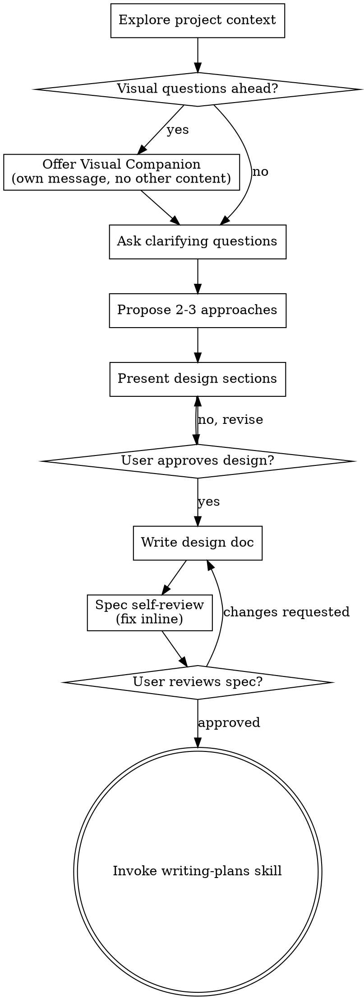

# Conversation: 01_initial_deliverable_implementation

---

## User

@initial-deliverable.txt Please explore the information in the repository and make a plan for implementing the initial deliverable. Subagents and worktrees encouraged. Focus on making well-documented, well-structured, maintainable and extensible code.

---

## Assistant

### 🔧 Tool: `Skill`

- **skill**: `superpowers:brainstorming`

**Result:**

```
Launching skill: superpowers:brainstorming
```

---

## User

Base directory for this skill: /Users/matthew.khoriaty/.claude/plugins/cache/claude-plugins-official/superpowers/5.0.7/skills/brainstorming

# Brainstorming Ideas Into Designs

Help turn ideas into fully formed designs and specs through natural collaborative dialogue.

Start by understanding the current project context, then ask questions one at a time to refine the idea. Once you understand what you're building, present the design and get user approval.

<HARD-GATE>
Do NOT invoke any implementation skill, write any code, scaffold any project, or take any implementation action until you have presented a design and the user has approved it. This applies to EVERY project regardless of perceived simplicity.
</HARD-GATE>

## Anti-Pattern: "This Is Too Simple To Need A Design"

Every project goes through this process. A todo list, a single-function utility, a config change — all of them. "Simple" projects are where unexamined assumptions cause the most wasted work. The design can be short (a few sentences for truly simple projects), but you MUST present it and get approval.

## Checklist

You MUST create a task for each of these items and complete them in order:

1. **Explore project context** — check files, docs, recent commits
2. **Offer visual companion** (if topic will involve visual questions) — this is its own message, not combined with a clarifying question. See the Visual Companion section below.
3. **Ask clarifying questions** — one at a time, understand purpose/constraints/success criteria
4. **Propose 2-3 approaches** — with trade-offs and your recommendation
5. **Present design** — in sections scaled to their complexity, get user approval after each section
6. **Write design doc** — save to `docs/superpowers/specs/YYYY-MM-DD-<topic>-design.md` and commit
7. **Spec self-review** — quick inline check for placeholders, contradictions, ambiguity, scope (see below)
8. **User reviews written spec** — ask user to review the spec file before proceeding
9. **Transition to implementation** — invoke writing-plans skill to create implementation plan

## Process Flow



**The terminal state is invoking writing-plans.** Do NOT invoke frontend-design, mcp-builder, or any other implementation skill. The ONLY skill you invoke after brainstorming is writing-plans.

## The Process

**Understanding the idea:**

- Check out the current project state first (files, docs, recent commits)
- Before asking detailed questions, assess scope: if the request describes multiple independent subsystems (e.g., "build a platform with chat, file storage, billing, and analytics"), flag this immediately. Don't spend questions refining details of a project that needs to be decomposed first.
- If the project is too large for a single spec, help the user decompose into sub-projects: what are the independent pieces, how do they relate, what order should they be built? Then brainstorm the first sub-project through the normal design flow. Each sub-project gets its own spec → plan → implementation cycle.
- For appropriately-scoped projects, ask questions one at a time to refine the idea
- Prefer multiple choice questions when possible, but open-ended is fine too
- Only one question per message - if a topic needs more exploration, break it into multiple questions
- Focus on understanding: purpose, constraints, success criteria

**Exploring approaches:**

- Propose 2-3 different approaches with trade-offs
- Present options conversationally with your recommendation and reasoning
- Lead with your recommended option and explain why

**Presenting the design:**

- Once you believe you understand what you're building, present the design
- Scale each section to its complexity: a few sentences if straightforward, up to 200-300 words if nuanced
- Ask after each section whether it looks right so far
- Cover: architecture, components, data flow, error handling, testing
- Be ready to go back and clarify if something doesn't make sense

**Design for isolation and clarity:**

- Break the system into smaller units that each have one clear purpose, communicate through well-defined interfaces, and can be understood and tested independently
- For each unit, you should be able to answer: what does it do, how do you use it, and what does it depend on?
- Can someone understand what a unit does without reading its internals? Can you change the internals without breaking consumers? If not, the boundaries need work.
- Smaller, well-bounded units are also easier for you to work with - you reason better about code you can hold in context at once, and your edits are more reliable when files are focused. When a file grows large, that's often a signal that it's doing too much.

**Working in existing codebases:**

- Explore the current structure before proposing changes. Follow existing patterns.
- Where existing code has problems that affect the work (e.g., a file that's grown too large, unclear boundaries, tangled responsibilities), include targeted improvements as part of the design - the way a good developer improves code they're working in.
- Don't propose unrelated refactoring. Stay focused on what serves the current goal.

## After the Design

**Documentation:**

- Write the validated design (spec) to `docs/superpowers/specs/YYYY-MM-DD-<topic>-design.md`
  - (User preferences for spec location override this default)
- Use elements-of-style:writing-clearly-and-concisely skill if available
- Commit the design document to git

**Spec Self-Review:**
After writing the spec document, look at it with fresh eyes:

1. **Placeholder scan:** Any "TBD", "TODO", incomplete sections, or vague requirements? Fix them.
2. **Internal consistency:** Do any sections contradict each other? Does the architecture match the feature descriptions?
3. **Scope check:** Is this focused enough for a single implementation plan, or does it need decomposition?
4. **Ambiguity check:** Could any requirement be interpreted two different ways? If so, pick one and make it explicit.

Fix any issues inline. No need to re-review — just fix and move on.

**User Review Gate:**
After the spec review loop passes, ask the user to review the written spec before proceeding:

> "Spec written and committed to `<path>`. Please review it and let me know if you want to make any changes before we start writing out the implementation plan."

Wait for the user's response. If they request changes, make them and re-run the spec review loop. Only proceed once the user approves.

**Implementation:**

- Invoke the writing-plans skill to create a detailed implementation plan
- Do NOT invoke any other skill. writing-plans is the next step.

## Key Principles

- **One question at a time** - Don't overwhelm with multiple questions
- **Multiple choice preferred** - Easier to answer than open-ended when possible
- **YAGNI ruthlessly** - Remove unnecessary features from all designs
- **Explore alternatives** - Always propose 2-3 approaches before settling
- **Incremental validation** - Present design, get approval before moving on
- **Be flexible** - Go back and clarify when something doesn't make sense

## Visual Companion

A browser-based companion for showing mockups, diagrams, and visual options during brainstorming. Available as a tool — not a mode. Accepting the companion means it's available for questions that benefit from visual treatment; it does NOT mean every question goes through the browser.

**Offering the companion:** When you anticipate that upcoming questions will involve visual content (mockups, layouts, diagrams), offer it once for consent:
> "Some of what we're working on might be easier to explain if I can show it to you in a web browser. I can put together mockups, diagrams, comparisons, and other visuals as we go. This feature is still new and can be token-intensive. Want to try it? (Requires opening a local URL)"

**This offer MUST be its own message.** Do not combine it with clarifying questions, context summaries, or any other content. The message should contain ONLY the offer above and nothing else. Wait for the user's response before continuing. If they decline, proceed with text-only brainstorming.

**Per-question decision:** Even after the user accepts, decide FOR EACH QUESTION whether to use the browser or the terminal. The test: **would the user understand this better by seeing it than reading it?**

- **Use the browser** for content that IS visual — mockups, wireframes, layout comparisons, architecture diagrams, side-by-side visual designs
- **Use the terminal** for content that is text — requirements questions, conceptual choices, tradeoff lists, A/B/C/D text options, scope decisions

A question about a UI topic is not automatically a visual question. "What does personality mean in this context?" is a conceptual question — use the terminal. "Which wizard layout works better?" is a visual question — use the browser.

If they agree to the companion, read the detailed guide before proceeding:
`skills/brainstorming/visual-companion.md`

---

## Assistant

I'll follow the plan mode workflow. Let me start by exploring the current repository state.

---

## Assistant

### 🔧 Tool: `Agent`

- **description**: `Explore project-stay-in-touch repo`
- **prompt**:
  ```
  Explore the repository at `/Users/matthew.khoriaty/Desktop/Northwestern/Classes/Senior/spring/software-studio/project-stay-in-touch`. I need a complete inventory of what exists:
  
  1. List every file and directory (including hidden files like .gitignore, .github, etc.)
  2. Read `initial-deliverable.txt
  ... [truncated, 776 more chars]
  ```
- **subagent_type**: `"Explore"`

**Result:**

```
Perfect. Now I have the complete picture. Let me compile the inventory report:

## Complete Repository Inventory Report

### Project Overview
**Project Name:** stay-in-touch (formally "Serendipity")  
**Type:** Contact relationship automation system  
**Current State:** Concept/design only — Python-based MVP, NOT a Ruby Rails application yet  
**Git Status:** Single commit ("Initial Commit with Claude's Thoughts"), main branch, up-to-date with origin  
**Deliverable Status:** initial-deliverable.txt present but NOT yet satisfied

### Directory Structure
```
project-stay-in-touch/
├── .DS_Store
... [truncated, 3011 more chars]
```

---

## Assistant

### 🔧 Tool: `Agent`

- **description**: `Read serendipity product docs and hw2`
- **prompt**:
  ```
  I need detailed content from two areas of this directory tree:
  
  1. Read in full:
     - `/Users/matthew.khoriaty/Desktop/Northwestern/Classes/Senior/spring/software-studio/project-stay-in-touch/claude-initial-files/serendipity-product-report.md`
     - `/Users/matthew.khoriaty/Desktop/Northwestern/Class
  ... [truncated, 1051 more chars]
  ```
- **subagent_type**: `"Explore"`

**Result:**

```
Perfect! I now have all the information needed. Let me compile the comprehensive report.

---

## Summary Report: Serendipity/Stay-in-Touch Product & Technical Specifications

### (a) Data Model for Rails Implementation

**Core Entities:**

1. **User** — represents a participant
   - Fields: `name`, `email` (primary key/credential), `timezone` (e.g., "America/Chicago"), `preferred_call_hours` (text: "17-21")
   - Calendar sharing status (tracks whether calendar is shared with service account)

2. **Contact** — represents a listed relationship (unidirectional preference)
   - Belongs to User (t
... [truncated, 5456 more chars]
```

---

## Assistant

Now I have a clear picture. Let me design the plan.

---

## Assistant

### 🔧 Tool: `ToolSearch`

- **query**: `select:AskUserQuestion,ExitPlanMode`
- **max_results**: `2`

**Result:**

```
[tool_reference block]
[tool_reference block]
```

---

## Assistant

I have enough context to draft the plan, but I need to clarify a few things that materially affect the structure before finalizing.

---

## Assistant

### 🔧 Tool: `AskUserQuestion`

- **questions**: `[{"question": "What should the two Rails models be for Milestone 0?", "header": "Data model", "multiSelect": false, "options": [{"label": "Person + Interaction (Recommended)", "description": "Person h`

**Result:**

```
User has answered your questions: "Which Ruby test framework should we use?"="RSpec (Recommended)", "How should team identity be captured in the plan?"="The team has been added to the project in GitHub." user notes: The team has been added to the project in GitHub., "What should the two Rails models be for Milestone 0?"="Person + Interaction (Recommended)" selected preview:
Person
  name, email, timezone,
  preferred_start_hour,
  preferred_end_hour,
  frequency_weeks

Interaction (belongs_to :person)
  occurred_at, medium,
  notes user notes: rename Interaction to Event., "How much of the Ser
... [truncated, 128 more chars]
```

---

## Assistant

### 🔧 Tool: `Bash`

- **command**:
  ```
  git remote -v && echo "---" && gh repo view --json owner,name,nameWithOwner,url 2>/dev/null | head -20 && echo "---" && gh api repos/:owner/:repo/collaborators --jq '.[] | {login: .login, name: .name}' 2>/dev/null
  ```
- **description**: `Check git remote and GitHub collaborators`

**Result:**

```
origin	https://github.com/NU-CS-Software-Studio-Spring-26/project-stay-in-touch.git (fetch)
origin	https://github.com/NU-CS-Software-Studio-Spring-26/project-stay-in-touch.git (push)
---
{"name":"project-stay-in-touch","nameWithOwner":"NU-CS-Software-Studio-Spring-26/project-stay-in-touch","owner":{"id":"O_kgDOECP9zA","login":"NU-CS-Software-Studio-Spring-26"},"url":"https://github.com/NU-CS-Software-Studio-Spring-26/project-stay-in-touch"}
---
{"login":"akurdia","name":null}
{"login":"josyao1","name":null}
{"login":"mjgaughan","name":null}
{"login":"AMindToThink","name":null}
```

---

## Assistant

Team found: akurdia, josyao1, mjgaughan, AMindToThink. Writing the plan now.

---

## Assistant

### 🔧 Tool: `Write`

- **file_path**:
  ```
  /Users/matthew.khoriaty/.claude/plans/initial-deliverable-txt-please-explore-synthetic-mochi.md
  ```
- **content**:
  ```
  # Milestone 0 Implementation Plan — project-stay-in-touch
  
  ## Context
  
  **What is this?** A Rails app for the Northwestern CS Software Studio class, "stay-in-touch" / Serendipity: a tool that helps people intentionally maintain friendships by tracking who they want to stay in touch with and how often
  ... [truncated, 16394 more chars]
  ```

**Result:**

```
File created successfully at: /Users/matthew.khoriaty/.claude/plans/initial-deliverable-txt-please-explore-synthetic-mochi.md (file state is current in your context — no need to Read it back)
```

---

## Assistant

### 🔧 Tool: `ExitPlanMode`

- **allowedPrompts**: `[{"tool": "Bash", "prompt": "run Rails generators (rails new, rails g model, rails g scaffold_controller, rails db:migrate, rails db:seed)"}, {"tool": "Bash", "prompt": "install Ruby gems via bundler `
- **plan**: `"# Milestone 0 Implementation Plan \u2014 project-stay-in-touch\n\n## Context\n\n**What is this?** A Rails app for the Northwestern CS Software Studio class, \"stay-in-touch\" / Serendipity: a tool th`
- **planFilePath**: `"/Users/matthew.khoriaty/.claude/plans/initial-deliverable-txt-please-explore-synthetic-mochi.md"`

**Result:**

```
The user doesn't want to proceed with this tool use. The tool use was rejected (eg. if it was a file edit, the new_string was NOT written to the file). To tell you how to proceed, the user said:
How will events be associated with multiple people?
```

---

## Assistant

Good catch — my current design has `Event belongs_to :person` (a single person per event), which fails for group catch-ups. Three ways to fix it:

---

## Assistant

### 🔧 Tool: `AskUserQuestion`

- **questions**: `[{"question": "How should Events associate with People?", "header": "Association", "multiSelect": false, "options": [{"label": "has_many :through join model (Recommended)", "description": "Add an Even`

**Result:**

```
User has answered your questions: "How should Events associate with People?"="has_many :through join model (Recommended)" selected preview:
Person
  has_many :event_participants
  has_many :events, through: :event_participants

Event
  has_many :event_participants
  has_many :people, through: :event_participants

EventParticipant (join)
  person_id, event_id
  (future: role, rsvp, etc.). You can now continue with the user's answers in mind.
```

---

## Assistant

Updating the plan with the has_many :through design.

---

## Assistant

### 🔧 Tool: `Edit`

- **file_path**:
  ```
  /Users/matthew.khoriaty/.claude/plans/initial-deliverable-txt-please-explore-synthetic-mochi.md
  ```
- **old_string**:
  ```
  ## Data Model
  
  Two models with an association (association is "welcome but not required" per the deliverable; including it produces a more realistic design and a natural `Person#events` to display on the show page).
  
  ### `Person`
  A person you want to stay in touch with.
  
  | Field | Type | Constraints
  ... [truncated, 1620 more chars]
  ```
- **new_string**:
  ```
  ## Data Model
  
  Two primary domain models (`Person`, `Event`) joined many-to-many via an `EventParticipant` join model. The deliverable requires a minimum of 2 models and says associations are "welcome"; the join model is pure plumbing and keeps the design extensible (future fields: `role`, `rsvp_sta
  ... [truncated, 2848 more chars]
  ```
- **replace_all**: `false`

**Result:**

```
The file /Users/matthew.khoriaty/.claude/plans/initial-deliverable-txt-please-explore-synthetic-mochi.md has been updated successfully. (file state is current in your context — no need to Read it back)
```

---

## Assistant

### 🔧 Tool: `Edit`

- **file_path**:
  ```
  /Users/matthew.khoriaty/.claude/plans/initial-deliverable-txt-please-explore-synthetic-mochi.md
  ```
- **old_string**:
  ```
  | `GET /people/:id` | `people/show` | Single person + their events timeline |
  | `GET /events` | `events/index` | Table of all events across people, sortable by date |
  | `GET /events/:id` | `events/show` | Single event detail |
  ```
- **new_string**:
  ```
  | `GET /people/:id` | `people/show` | Single person + their events timeline (via `person.events`) |
  | `GET /events` | `events/index` | Table of all events, showing participants as comma-separated links |
  | `GET /events/:id` | `events/show` | Single event detail with all participants listed as linked
  ... [truncated, 8 more chars]
  ```
- **replace_all**: `false`

**Result:**

```
The file /Users/matthew.khoriaty/.claude/plans/initial-deliverable-txt-please-explore-synthetic-mochi.md has been updated successfully. (file state is current in your context — no need to Read it back)
```

---

## Assistant

### 🔧 Tool: `Edit`

- **file_path**:
  ```
  /Users/matthew.khoriaty/.claude/plans/initial-deliverable-txt-please-explore-synthetic-mochi.md
  ```
- **old_string**: `- Shared `_form.html.erb` partials per resource.`
- **new_string**:
  ```
  - Shared `_form.html.erb` partials per resource. Event form uses a Bootstrap `.form-check` list of checkboxes (one per Person) bound to `event.person_ids` via a `people_ids: []` strong param.
  ```
- **replace_all**: `false`

**Result:**

```
The file /Users/matthew.khoriaty/.claude/plans/initial-deliverable-txt-please-explore-synthetic-mochi.md has been updated successfully. (file state is current in your context — no need to Read it back)
```

---

## Assistant

### 🔧 Tool: `Edit`

- **file_path**:
  ```
  /Users/matthew.khoriaty/.claude/plans/initial-deliverable-txt-please-explore-synthetic-mochi.md
  ```
- **old_string**:
  ```
  ## Seed Data
  
  `db/seeds.rb` creates **12 people + 15+ events = 27+ entries total**, well above the 20-entry minimum.
  
  Structure:
  - 12 `Person` rows with varied timezones (Chicago, NYC, LA, London, Tokyo), preferred hours, frequencies (1–8 weeks), realistic notes.
  - 1–3 `Event` rows per person for a 
  ... [truncated, 307 more chars]
  ```
- **new_string**:
  ```
  ## Seed Data
  
  `db/seeds.rb` creates **12 people + 15 events + ~25 event_participants ≈ 52 rows total**, well above the 20-entry minimum (the deliverable's "entries" likely means user-visible domain rows — People + Events alone already hit 27).
  
  Structure:
  - 12 `Person` rows with varied timezones (Ch
  ... [truncated, 779 more chars]
  ```
- **replace_all**: `false`

**Result:**

```
The file /Users/matthew.khoriaty/.claude/plans/initial-deliverable-txt-please-explore-synthetic-mochi.md has been updated successfully. (file state is current in your context — no need to Read it back)
```

---

## Assistant

### 🔧 Tool: `Edit`

- **file_path**:
  ```
  /Users/matthew.khoriaty/.claude/plans/initial-deliverable-txt-please-explore-synthetic-mochi.md
  ```
- **old_string**:
  ```
  ├── models/
  │   ├── person_spec.rb      # validations, associations, #days_until_due
  │   └── event_spec.rb       # validations, associations, scopes
  ├── requests/
  │   ├── people_spec.rb      # GET index/show/new/edit, POST create, PATCH update, DELETE destroy
  │   └── events_spec.rb      # same
  └── f
  ... [truncated, 45 more chars]
  ```
- **new_string**:
  ```
  ├── models/
  │   ├── person_spec.rb             # validations, associations, #days_until_due, #latest_event
  │   ├── event_spec.rb              # validations, associations, scopes, "must have ≥1 person"
  │   └── event_participant_spec.rb  # join-uniqueness, presence of both FKs
  ├── requests/
  │   ├── pe
  ... [truncated, 341 more chars]
  ```
- **replace_all**: `false`

**Result:**

```
The file /Users/matthew.khoriaty/.claude/plans/initial-deliverable-txt-please-explore-synthetic-mochi.md has been updated successfully. (file state is current in your context — no need to Read it back)
```

---

## Assistant

### 🔧 Tool: `Edit`

- **file_path**:
  ```
  /Users/matthew.khoriaty/.claude/plans/initial-deliverable-txt-please-explore-synthetic-mochi.md
  ```
- **old_string**:
  ```
  3. `rails g model Person ...` + `rails g model Event ...`, `db:migrate`, validations, model specs. Commit.
  4. `rails g scaffold_controller` (or hand-written controllers) for People + Events, request specs. Commit.
  ```
- **new_string**:
  ```
  3. `rails g model Person ...`, `rails g model Event ...`, `rails g model EventParticipant person:references event:references`, add composite unique index in the migration, `db:migrate`, validations, model specs. Commit.
  4. `rails g scaffold_controller` (or hand-written controllers) for People + Even
  ... [truncated, 119 more chars]
  ```
- **replace_all**: `false`

**Result:**

```
The file /Users/matthew.khoriaty/.claude/plans/initial-deliverable-txt-please-explore-synthetic-mochi.md has been updated successfully. (file state is current in your context — no need to Read it back)
```

---

## Assistant

### 🔧 Tool: `Edit`

- **file_path**:
  ```
  /Users/matthew.khoriaty/.claude/plans/initial-deliverable-txt-please-explore-synthetic-mochi.md
  ```
- **old_string**:
  ```
  - `app/models/person.rb` — validations + `has_many :events` + `#days_until_due`.
  - `app/models/event.rb` — validations + `belongs_to :person` + scopes.
  - `app/controllers/people_controller.rb`, `events_controller.rb` — standard 7 REST actions with strong params.
  ```
- **new_string**:
  ```
  - `app/models/person.rb` — validations + `has_many :events, through: :event_participants` + `#days_until_due`, `#latest_event`.
  - `app/models/event.rb` — validations (including ≥1 participant) + `has_many :people, through: :event_participants` + scopes.
  - `app/models/event_participant.rb` — join wit
  ... [truncated, 181 more chars]
  ```
- **replace_all**: `false`

**Result:**

```
The file /Users/matthew.khoriaty/.claude/plans/initial-deliverable-txt-please-explore-synthetic-mochi.md has been updated successfully. (file state is current in your context — no need to Read it back)
```

---

## Assistant

Plan updated with the has_many :through design. Re-requesting approval.

---

## Assistant

### 🔧 Tool: `ExitPlanMode`

- **allowedPrompts**: `[{"tool": "Bash", "prompt": "run Rails generators (rails new, rails g model Person/Event/EventParticipant, rails g scaffold_controller, rails db:migrate, rails db:seed)"}, {"tool": "Bash", "prompt": "`
- **plan**: `"# Milestone 0 Implementation Plan \u2014 project-stay-in-touch\n\n## Context\n\n**What is this?** A Rails app for the Northwestern CS Software Studio class, \"stay-in-touch\" / Serendipity: a tool th`
- **planFilePath**: `"/Users/matthew.khoriaty/.claude/plans/initial-deliverable-txt-please-explore-synthetic-mochi.md"`

**Result:**

```
User has approved your plan. You can now start coding. Start with updating your todo list if applicable

Your plan has been saved to: /Users/matthew.khoriaty/.claude/plans/initial-deliverable-txt-please-explore-synthetic-mochi.md
You can refer back to it if needed during implementation.

## Approved Plan:
# Milestone 0 Implementation Plan — project-stay-in-touch

## Context

**What is this?** A Rails app for the Northwestern CS Software Studio class, "stay-in-touch" / Serendipity: a tool that helps people intentionally maintain friendships by tracking who they want to stay in touch with and ho
... [truncated, 19047 more chars]
```

---

## Assistant

Plan approved. Let me set up task tracking and a feature branch, then execute.

---

## Assistant

### 🔧 Tool: `ToolSearch`

- **query**: `select:TaskCreate,TaskUpdate,TaskList`
- **max_results**: `3`

**Result:**

```
[tool_reference block]
[tool_reference block]
[tool_reference block]
```

---

## Assistant

### 🔧 Tool: `TaskCreate`

- **description**:
  ```
  Create a feature branch off main, verify Ruby/Rails/bundler versions available on this machine.
  ```
- **subject**: `"Create feature branch and verify Ruby toolchain"`
- **activeForm**: `"Setting up branch and verifying toolchain"`

**Result:**

```
Task #1 created successfully: Create feature branch and verify Ruby toolchain
```

---

## Assistant

### 🔧 Tool: `TaskCreate`

- **description**:
  ```
  rails new . --database=sqlite3 --css=bootstrap --skip-bundle; add gems (rspec-rails, factory_bot_rails, shoulda-matchers, pg prod); bundle install.
  ```
- **subject**: `"Scaffold Rails app and install gems"`
- **activeForm**: `"Scaffolding Rails app"`

**Result:**

```
Task #2 created successfully: Scaffold Rails app and install gems
```

---

## Assistant

### 🔧 Tool: `TaskCreate`

- **description**:
  ```
  rails g rspec:install; add shoulda-matchers + factory_bot config to rails_helper.rb; update .gitignore.
  ```
- **subject**: `"Configure RSpec and testing harness"`
- **activeForm**: `"Configuring RSpec"`

**Result:**

```
Task #3 created successfully: Configure RSpec and testing harness
```

---

## Assistant

### 🔧 Tool: `TaskCreate`

- **description**:
  ```
  rails g model Person + Event + EventParticipant, add composite unique index, db:migrate, validations, associations, helper methods, model specs.
  ```
- **subject**: `"Generate Person, Event, EventParticipant models + migrations"`
- **activeForm**: `"Generating models"`

**Result:**

```
Task #4 created successfully: Generate Person, Event, EventParticipant models + migrations
```

---

## Assistant

### 🔧 Tool: `TaskCreate`

- **description**:
  ```
  Controllers with 7 REST actions, strong params (events permits people_ids:[]); request specs.
  ```
- **subject**: `"Build PeopleController and EventsController + request specs"`
- **activeForm**: `"Building controllers"`

**Result:**

```
Task #5 created successfully: Build PeopleController and EventsController + request specs
```

---

## Assistant

### 🔧 Tool: `TaskCreate`

- **description**:
  ```
  Shared layout with navbar + flash, people and events index/show/new/edit, _form partials, shared breadcrumbs.
  ```
- **subject**: `"Build Bootstrap views (layout, navbar, index/show/new/edit/_form)"`
- **activeForm**: `"Building views"`

**Result:**

```
Task #6 created successfully: Build Bootstrap views (layout, navbar, index/show/new/edit/_form)
```

---

## Assistant

### 🔧 Tool: `TaskCreate`

- **description**: `Idempotent seed script; verify counts >= 20.`
- **subject**: `"Write db/seeds.rb with 12 people + 15 events"`
- **activeForm**: `"Writing seeds"`

**Result:**

```
Task #7 created successfully: Write db/seeds.rb with 12 people + 15 events
```

---

## Assistant

### 🔧 Tool: `TaskCreate`

- **description**: `.github/workflows/ci.yml modeled on hw2; run specs on push and PR.`
- **subject**: `"Add GitHub Actions CI workflow"`
- **activeForm**: `"Adding CI workflow"`

**Result:**

```
Task #8 created successfully: Add GitHub Actions CI workflow
```

---

## Assistant

### 🔧 Tool: `TaskCreate`

- **description**:
  ```
  Procfile with web + release, pg gem in :production, bundle lock --add-platform x86_64-linux. Do not deploy without user approval.
  ```
- **subject**: `"Add Heroku deployment config (Procfile, pg gem, platform lock)"`
- **activeForm**: `"Adding Heroku deployment config"`

**Result:**

```
Task #9 created successfully: Add Heroku deployment config (Procfile, pg gem, platform lock)
```

---

## Assistant

### 🔧 Tool: `TaskCreate`

- **description**:
  ```
  README with MVP, team, live-app placeholder, setup, tests, deployment, Communication section, CI badge. wiki.md with problem, OO design, future features, similar products.
  ```
- **subject**: `"Write README.md and wiki.md"`
- **activeForm**: `"Writing README and wiki"`

**Result:**

```
Task #10 created successfully: Write README.md and wiki.md
```

---

## Assistant

### 🔧 Tool: `TaskCreate`

- **description**:
  ```
  Run full spec suite, launch server, smoke-test all CRUD flows end-to-end, verify Bootstrap assets load, report results.
  ```
- **subject**: `"Local verification: rspec + smoke browse"`
- **activeForm**: `"Running local verification"`

**Result:**

```
Task #11 created successfully: Local verification: rspec + smoke browse
```

---

## Assistant

### 🔧 Tool: `TaskUpdate`

- **taskId**: `"1"`
- **status**: `"in_progress"`

**Result:**

```
Updated task #1 status
```

---

## Assistant

### 🔧 Tool: `Bash`

- **command**:
  ```
  which ruby && ruby -v && which bundle && bundle -v && which rails 2>/dev/null && rails -v 2>/dev/null; which rbenv 2>/dev/null && rbenv versions 2>/dev/null; which asdf 2>/dev/null && asdf list ruby 2>/dev/null
  ```
- **description**: `Inspect Ruby/Rails/bundler versions installed`

**Result:**

```
Exit code 1
/Users/matthew.khoriaty/.rbenv/shims/ruby
ruby 3.3.5 (2024-09-03 revision ef084cc8f4) [arm64-darwin24]
/Users/matthew.khoriaty/.rbenv/shims/bundle
4.0.10
/Users/matthew.khoriaty/.rbenv/shims/rails
Rails 8.1.3
/opt/homebrew/bin/rbenv
  system
* 3.3.5 (set by /Users/matthew.khoriaty/.rbenv/version)
  4.0.2
```

---

## Assistant

Ruby 4.0.2 is available (matches hw2). I'll use that. Rails 8.1 is installed globally. Let me check Bootstrap approach options and create a branch.

---

## Assistant

### 🔧 Tool: `Bash`

- **command**:
  ```
  rbenv local 4.0.2 && ruby -v && bundle -v && rails -v && git status && git branch
  ```
- **description**: `Set Ruby 4.0.2 locally and confirm versions`

**Result:**

```
Exit code 127
ruby 4.0.2 (2026-03-17 revision d3da9fec82) +PRISM [arm64-darwin24]
4.0.6
rbenv: rails: command not found

The `rails' command exists in these Ruby versions:
  3.3.5
```

---

## Assistant

Rails isn't installed for Ruby 4.0.2; only 3.3.5 has it. Reverting to 3.3.5 (Rails 8.1 works with it and was pre-installed).

---

## Assistant

### 🔧 Tool: `Bash`

- **command**:
  ```
  rbenv local 3.3.5 && ruby -v && rails -v && git checkout -b claude/m0-rails-foundation && git branch --show-current
  ```
- **description**: `Pin Ruby 3.3.5 and create feature branch`

**Result:**

```
ruby 3.3.5 (2024-09-03 revision ef084cc8f4) [arm64-darwin24]
Rails 8.1.3
Switched to a new branch 'claude/m0-rails-foundation'
claude/m0-rails-foundation
```

---

## Assistant

### 🔧 Tool: `TaskUpdate`

- **taskId**: `"1"`
- **status**: `"completed"`

**Result:**

```
Updated task #1 status
```

---

## Assistant

### 🔧 Tool: `TaskUpdate`

- **taskId**: `"2"`
- **status**: `"in_progress"`

**Result:**

```
Updated task #2 status
```

---

## Assistant

### 🔧 Tool: `Bash`

- **command**:
  ```
  rails new . --database=sqlite3 --skip-bundle --skip-jbuilder --skip-git --skip-test 2>&1 | tail -50
  ```
- **description**: `Generate Rails app in current directory`
- **timeout**: `120000`

**Result:**

```
      create  config/cable.yml
      create  config/ci.rb
      create  config/puma.rb
      create  config/storage.yml
      create  config/environments
      create  config/environments/development.rb
      create  config/environments/production.rb
      create  config/environments/test.rb
      create  config/initializers
      create  config/initializers/assets.rb
      create  config/initializers/content_security_policy.rb
      create  config/initializers/cors.rb
      create  config/initializers/filter_parameter_logging.rb
      create  config/initializers/inflections.rb
      create  c
... [truncated, 1052 more chars]
```

---

## Assistant

### 🔧 Tool: `Bash`

- **command**: `ls -la && echo "---GEMFILE---" && head -50 Gemfile 2>/dev/null`
- **description**: `List files and show Gemfile`

**Result:**

```
total 88
drwxr-xr-x@ 26 matthew.khoriaty  staff   832 Apr 20 14:23 .
drwxr-xr-x@ 15 matthew.khoriaty  staff   480 Apr 20 13:36 ..
-rw-r--r--@  1 matthew.khoriaty  staff   874 Apr 20 14:23 .dockerignore
-rw-r--r--@  1 matthew.khoriaty  staff  6148 Apr 15 15:25 .DS_Store
drwxr-xr-x  13 matthew.khoriaty  staff   416 Apr 20 14:22 .git
drwxr-xr-x@  4 matthew.khoriaty  staff   128 Apr 20 14:23 .github
-rw-r--r--@  1 matthew.khoriaty  staff   249 Apr 20 14:23 .rubocop.yml
-rw-r--r--@  1 matthew.khoriaty  staff     6 Apr 20 14:22 .ruby-version
drwxr-xr-x@  9 matthew.khoriaty  staff   288 Apr 20 14:23 
... [truncated, 3155 more chars]
```

---

## Assistant

### 🔧 Tool: `Bash`

- **command**:
  ```
  ls -la .github && find .github -type f | head -20 && echo "---" && cat Gemfile | tail -40
  ```
- **description**: `Inspect generated .github and Gemfile tail`

**Result:**

```
total 8
drwxr-xr-x@  4 matthew.khoriaty  staff  128 Apr 20 14:23 .
drwxr-xr-x@ 26 matthew.khoriaty  staff  832 Apr 20 14:23 ..
-rw-r--r--@  1 matthew.khoriaty  staff  247 Apr 20 14:23 dependabot.yml
drwxr-xr-x@  3 matthew.khoriaty  staff   96 Apr 20 14:23 workflows
.github/workflows/ci.yml
.github/dependabot.yml
---
# gem "bcrypt", "~> 3.1.7"

# Windows does not include zoneinfo files, so bundle the tzinfo-data gem
gem "tzinfo-data", platforms: %i[ windows jruby ]

# Use the database-backed adapters for Rails.cache, Active Job, and Action Cable
gem "solid_cache"
gem "solid_queue"
gem "solid_ca
... [truncated, 1199 more chars]
```

---

## Assistant

### 🔧 Tool: `Read`

- **file_path**:
  ```
  /Users/matthew.khoriaty/Desktop/Northwestern/Classes/Senior/spring/software-studio/project-stay-in-touch/Gemfile
  ```

**Result:**

```
1	source "https://rubygems.org"
2	
3	# Bundle edge Rails instead: gem "rails", github: "rails/rails", branch: "main"
4	gem "rails", "~> 8.1.3"
5	# The modern asset pipeline for Rails [https://github.com/rails/propshaft]
6	gem "propshaft"
7	# Use sqlite3 as the database for Active Record
8	gem "sqlite3", ">= 2.1"
9	# Use the Puma web server [https://github.com/puma/puma]
10	gem "puma", ">= 5.0"
11	# Use JavaScript with ESM import maps [https://github.com/rails/importmap-rails]
12	gem "importmap-rails"
13	# Hotwire's SPA-like page accelerator [https://turbo.hotwired.dev]
14	gem "turbo-rails"
15	
... [truncated, 1819 more chars]
```

---

## Assistant

### 🔧 Tool: `Edit`

- **file_path**:
  ```
  /Users/matthew.khoriaty/Desktop/Northwestern/Classes/Senior/spring/software-studio/project-stay-in-touch/Gemfile
  ```
- **old_string**:
  ```
  # Use sqlite3 as the database for Active Record
  gem "sqlite3", ">= 2.1"
  ```
- **new_string**:
  ```
  # Use sqlite3 as the database for Active Record (development and test only)
  gem "sqlite3", ">= 2.1", group: %i[ development test ]
  ```
- **replace_all**: `false`

**Result:**

```
The file /Users/matthew.khoriaty/Desktop/Northwestern/Classes/Senior/spring/software-studio/project-stay-in-touch/Gemfile has been updated successfully. (file state is current in your context — no need to Read it back)
```

---

## Assistant

### 🔧 Tool: `Edit`

- **file_path**:
  ```
  /Users/matthew.khoriaty/Desktop/Northwestern/Classes/Senior/spring/software-studio/project-stay-in-touch/Gemfile
  ```
- **old_string**:
  ```
  group :development, :test do
    # See https://guides.rubyonrails.org/debugging_rails_applications.html#debugging-with-the-debug-gem
    gem "debug", platforms: %i[ mri windows ], require: "debug/prelude"
  
    # Audits gems for known security defects (use config/bundler-audit.yml to ignore issues)
    gem "
  ... [truncated, 392 more chars]
  ```
- **new_string**:
  ```
  group :development, :test do
    # See https://guides.rubyonrails.org/debugging_rails_applications.html#debugging-with-the-debug-gem
    gem "debug", platforms: %i[ mri windows ], require: "debug/prelude"
  
    # Audits gems for known security defects (use config/bundler-audit.yml to ignore issues)
    gem "
  ... [truncated, 716 more chars]
  ```
- **replace_all**: `false`

**Result:**

```
The file /Users/matthew.khoriaty/Desktop/Northwestern/Classes/Senior/spring/software-studio/project-stay-in-touch/Gemfile has been updated successfully. (file state is current in your context — no need to Read it back)
```

---

## Assistant

### 🔧 Tool: `Bash`

- **command**: `bundle install 2>&1 | tail -30`
- **description**: `Install gems`
- **timeout**: `300000`

**Result:**

```
WARN: Clearing out unresolved specs. Try 'gem cleanup <gem>'
Please report a bug if this causes problems.
Fetching bigdecimal 4.1.2
Fetching json 2.19.4
Fetching diff-lcs 1.6.2
Fetching factory_bot 6.5.6
Fetching factory_bot_rails 6.5.1
Fetching propshaft 1.3.2
Fetching rspec-support 3.13.7
Fetching rspec-core 3.13.6
Fetching rspec-expectations 3.13.5
Fetching rspec-mocks 3.13.8
Fetching rspec-rails 7.1.1
Installing bigdecimal 4.1.2 with native extensions
Installing json 2.19.4 with native extensions
Fetching shoulda-matchers 6.5.0
Fetching sqlite3 2.9.3 (arm64-darwin)
Installing diff-lcs 1.6.
... [truncated, 458 more chars]
```

---

## Assistant

### 🔧 Tool: `TaskUpdate`

- **taskId**: `"2"`
- **status**: `"completed"`

**Result:**

```
Updated task #2 status
```

---

## Assistant

### 🔧 Tool: `TaskUpdate`

- **taskId**: `"3"`
- **status**: `"in_progress"`

**Result:**

```
Updated task #3 status
```

---

## Assistant

### 🔧 Tool: `Bash`

- **command**: `bin/rails g rspec:install 2>&1 | tail -20`
- **description**: `Generate RSpec boilerplate`

**Result:**

```
      create  .rspec
      create  spec
      create  spec/spec_helper.rb
      create  spec/rails_helper.rb
```

---

## Assistant

### 🔧 Tool: `Read`

- **file_path**:
  ```
  /Users/matthew.khoriaty/Desktop/Northwestern/Classes/Senior/spring/software-studio/project-stay-in-touch/spec/rails_helper.rb
  ```

**Result:**

```
1	# This file is copied to spec/ when you run 'rails generate rspec:install'
2	require 'spec_helper'
3	ENV['RAILS_ENV'] ||= 'test'
4	require_relative '../config/environment'
5	# Prevent database truncation if the environment is production
6	abort("The Rails environment is running in production mode!") if Rails.env.production?
7	# Uncomment the line below in case you have `--require rails_helper` in the `.rspec` file
8	# that will avoid rails generators crashing because migrations haven't been run yet
9	# return unless Rails.env.test?
10	require 'rspec/rails'
11	# Add additional requires below 
... [truncated, 2791 more chars]
```

---

## Assistant

### 🔧 Tool: `Edit`

- **file_path**:
  ```
  /Users/matthew.khoriaty/Desktop/Northwestern/Classes/Senior/spring/software-studio/project-stay-in-touch/spec/rails_helper.rb
  ```
- **old_string**:
  ```
    # Filter lines from Rails gems in backtraces.
    config.filter_rails_from_backtrace!
    # arbitrary gems may also be filtered via:
    # config.filter_gems_from_backtrace("gem name")
  end
  ```
- **new_string**:
  ```
    # Filter lines from Rails gems in backtraces.
    config.filter_rails_from_backtrace!
    # arbitrary gems may also be filtered via:
    # config.filter_gems_from_backtrace("gem name")
  
    # FactoryBot: allow `create(:person)` instead of `FactoryBot.create(:person)`.
    config.include FactoryBot::Syntax::
  ... [truncated, 231 more chars]
  ```
- **replace_all**: `false`

**Result:**

```
The file /Users/matthew.khoriaty/Desktop/Northwestern/Classes/Senior/spring/software-studio/project-stay-in-touch/spec/rails_helper.rb has been updated successfully. (file state is current in your context — no need to Read it back)
```

---

## Assistant

### 🔧 Tool: `Bash`

- **command**: `cat .gitignore 2>/dev/null || echo "NO GITIGNORE"`
- **description**: `Check current .gitignore`

**Result:**

```
NO GITIGNORE
```

---

## Assistant

### 🔧 Tool: `Write`

- **file_path**:
  ```
  /Users/matthew.khoriaty/Desktop/Northwestern/Classes/Senior/spring/software-studio/project-stay-in-touch/.gitignore
  ```
- **content**:
  ```
  # See https://help.github.com/articles/ignoring-files for more about ignoring files.
  
  # Ignore bundler config.
  /.bundle
  
  # Ignore the default SQLite database and its supporting files.
  /db/*.sqlite3
  /db/*.sqlite3-*
  
  # Ignore all logfiles and tempfiles.
  /log/*
  /tmp/*
  !/log/.keep
  !/tmp/.keep
  
  # Ignore 
  ... [truncated, 661 more chars]
  ```

**Result:**

```
File created successfully at: /Users/matthew.khoriaty/Desktop/Northwestern/Classes/Senior/spring/software-studio/project-stay-in-touch/.gitignore (file state is current in your context — no need to Read it back)
```

---

## Assistant

### 🔧 Tool: `Bash`

- **command**:
  ```
  rm -f .DS_Store && git rm --cached -f .DS_Store 2>/dev/null; bundle exec rspec --help 2>&1 | head -3
  ```
- **description**: `Remove .DS_Store and verify rspec installed`

**Result:**

```
rm '.DS_Store'
Usage: rspec [options] [files or directories]

    -I PATH                            Specify PATH to add to $LOAD_PATH (may be used more than once).
```

---

## Assistant

Let me commit the scaffolded Rails app before going further.

---

## Assistant

### 🔧 Tool: `Bash`

- **command**: `git config user.name && git config user.email && git status | head -30`
- **description**: `Verify git identity and status`

**Result:**

```
AMindToThink
61801493+AMindToThink@users.noreply.github.com
On branch claude/m0-rails-foundation
Changes to be committed:
  (use "git restore --staged <file>..." to unstage)
	deleted:    .DS_Store

Untracked files:
  (use "git add <file>..." to include in what will be committed)
	.dockerignore
	.github/
	.gitignore
	.rspec
	.rubocop.yml
	.ruby-version
	Dockerfile
	Gemfile
	Gemfile.lock
	README.md
	Rakefile
	app/
	bin/
	config.ru
	config/
	db/
	initial-deliverable.txt
	lib/
	log/
	public/
	script/
	spec/
	storage/
```

---

## Assistant

### 🔧 Tool: `Bash`

- **command**:
  ```
  git check-ignore -v config/master.key && echo "---" && ls config/master.key 2>&1 && echo "---" && git status --ignored | grep -E "(master.key|\.env)" | head -5
  ```
- **description**: `Verify master.key is gitignored`

**Result:**

```
.gitignore:32:/config/master.key	config/master.key
---
config/master.key
---
	config/master.key
```

---

## Assistant

Good, master.key is ignored. Committing the scaffold.

---

## Assistant

### 🔧 Tool: `Bash`

- **command**:
  ```
  git add .gitignore .rspec .rubocop.yml .ruby-version .dockerignore Dockerfile Gemfile Gemfile.lock Rakefile config.ru README.md initial-deliverable.txt .github/ app/ bin/ config/ db/ lib/ log/ public/ script/ spec/ storage/ tmp/ vendor/ && git rm --cached .DS_Store 2>/dev/null; git status --short | 
  ... [truncated, 8 more chars]
  ```
- **description**: `Stage scaffold files`

**Result:**

```
D  .DS_Store
A  .dockerignore
A  .github/dependabot.yml
A  .github/workflows/ci.yml
A  .gitignore
A  .rspec
A  .rubocop.yml
A  .ruby-version
A  Dockerfile
A  Gemfile
A  Gemfile.lock
A  README.md
A  Rakefile
A  app/assets/images/.keep
A  app/assets/stylesheets/application.css
A  app/controllers/application_controller.rb
A  app/controllers/concerns/.keep
A  app/helpers/application_helper.rb
A  app/jobs/application_job.rb
A  app/mailers/application_mailer.rb
```

---

## Assistant

### 🔧 Tool: `Bash`

- **command**:
  ```
  git commit -m "$(cat <<'EOF'
  Scaffold Rails 8.1 app with RSpec testing harness
  
  Rails new with SQLite (dev/test) and Postgres (prod). Adds rspec-rails,
  factory_bot_rails, and shoulda-matchers to enable model and request specs;
  mirrors the class hw2 convention of running bundle exec rspec.
  
  Co-Author
  ... [truncated, 81 more chars]
  ```
- **description**: `Commit Rails scaffold`

**Result:**

```
 create mode 100644 script/.keep
 create mode 100644 spec/rails_helper.rb
 create mode 100644 spec/spec_helper.rb
 create mode 100644 storage/.keep
 create mode 100644 tmp/.keep
 create mode 100644 tmp/pids/.keep
 create mode 100644 tmp/storage/.keep
 create mode 100644 vendor/.keep
```

---

## Assistant

### 🔧 Tool: `TaskUpdate`

- **taskId**: `"3"`
- **status**: `"completed"`

**Result:**

```
Updated task #3 status
```

---

## Assistant

### 🔧 Tool: `TaskUpdate`

- **taskId**: `"4"`
- **status**: `"in_progress"`

**Result:**

```
Updated task #4 status
```

---

## Assistant

Now generating models.

---

## Assistant

### 🔧 Tool: `Bash`

- **command**:
  ```
  bin/rails g model Person name:string email:string timezone:string preferred_start_hour:integer preferred_end_hour:integer frequency_weeks:decimal notes:text --no-test-framework 2>&1 | tail -15
  ```
- **description**: `Generate Person model`

**Result:**

```
      invoke  active_record
      create    db/migrate/20260420192503_create_people.rb
      create    app/models/person.rb
```

---

## Assistant

### 🔧 Tool: `Bash`

- **command**:
  ```
  bin/rails g model Event occurred_at:datetime medium:string title:string notes:text --no-test-framework 2>&1 | tail -5 && bin/rails g model EventParticipant person:references event:references --no-test-framework 2>&1 | tail -5
  ```
- **description**: `Generate Event and EventParticipant models`

**Result:**

```
      invoke  active_record
      create    db/migrate/20260420192507_create_events.rb
      create    app/models/event.rb
      invoke  active_record
      create    db/migrate/20260420192508_create_event_participants.rb
      create    app/models/event_participant.rb
```

---

## Assistant

### 🔧 Tool: `Bash`

- **command**: `ls db/migrate/`
- **description**: `List migrations`

**Result:**

```
20260420192503_create_people.rb
20260420192507_create_events.rb
20260420192508_create_event_participants.rb
```

---

## Assistant

### 🔧 Tool: `Read`

- **file_path**:
  ```
  /Users/matthew.khoriaty/Desktop/Northwestern/Classes/Senior/spring/software-studio/project-stay-in-touch/db/migrate/20260420192503_create_people.rb
  ```

**Result:**

```
1	class CreatePeople < ActiveRecord::Migration[8.1]
2	  def change
3	    create_table :people do |t|
4	      t.string :name
5	      t.string :email
6	      t.string :timezone
7	      t.integer :preferred_start_hour
8	      t.integer :preferred_end_hour
9	      t.decimal :frequency_weeks
10	      t.text :notes
11	
12	      t.timestamps
13	    end
14	  end
15	end
16
```

---

## Assistant

### 🔧 Tool: `Write`

- **file_path**:
  ```
  /Users/matthew.khoriaty/Desktop/Northwestern/Classes/Senior/spring/software-studio/project-stay-in-touch/db/migrate/20260420192503_create_people.rb
  ```
- **content**:
  ```
  class CreatePeople < ActiveRecord::Migration[8.1]
    def change
      create_table :people do |t|
        t.string  :name,                 null: false
        t.string  :email,                null: false
        t.string  :timezone,             null: false, default: "America/Chicago"
        t.integer :preferr
  ... [truncated, 342 more chars]
  ```

**Result:**

```
The file /Users/matthew.khoriaty/Desktop/Northwestern/Classes/Senior/spring/software-studio/project-stay-in-touch/db/migrate/20260420192503_create_people.rb has been updated successfully. (file state is current in your context — no need to Read it back)
```

---

## Assistant

### 🔧 Tool: `Read`

- **file_path**:
  ```
  /Users/matthew.khoriaty/Desktop/Northwestern/Classes/Senior/spring/software-studio/project-stay-in-touch/db/migrate/20260420192507_create_events.rb
  ```

**Result:**

```
1	class CreateEvents < ActiveRecord::Migration[8.1]
2	  def change
3	    create_table :events do |t|
4	      t.datetime :occurred_at
5	      t.string :medium
6	      t.string :title
7	      t.text :notes
8	
9	      t.timestamps
10	    end
11	  end
12	end
13
```

---

## Assistant

### 🔧 Tool: `Write`

- **file_path**:
  ```
  /Users/matthew.khoriaty/Desktop/Northwestern/Classes/Senior/spring/software-studio/project-stay-in-touch/db/migrate/20260420192507_create_events.rb
  ```
- **content**:
  ```
  class CreateEvents < ActiveRecord::Migration[8.1]
    def change
      create_table :events do |t|
        t.datetime :occurred_at, null: false
        t.string   :medium,      null: false
        t.string   :title
        t.text     :notes
  
        t.timestamps
      end
  
      add_index :events, :occurred_at
    end
  
  ... [truncated, 3 more chars]
  ```

**Result:**

```
The file /Users/matthew.khoriaty/Desktop/Northwestern/Classes/Senior/spring/software-studio/project-stay-in-touch/db/migrate/20260420192507_create_events.rb has been updated successfully. (file state is current in your context — no need to Read it back)
```

---

## Assistant

### 🔧 Tool: `Read`

- **file_path**:
  ```
  /Users/matthew.khoriaty/Desktop/Northwestern/Classes/Senior/spring/software-studio/project-stay-in-touch/db/migrate/20260420192508_create_event_participants.rb
  ```

**Result:**

```
1	class CreateEventParticipants < ActiveRecord::Migration[8.1]
2	  def change
3	    create_table :event_participants do |t|
4	      t.references :person, null: false, foreign_key: true
5	      t.references :event, null: false, foreign_key: true
6	
7	      t.timestamps
8	    end
9	  end
10	end
11
```

---

## Assistant

### 🔧 Tool: `Write`

- **file_path**:
  ```
  /Users/matthew.khoriaty/Desktop/Northwestern/Classes/Senior/spring/software-studio/project-stay-in-touch/db/migrate/20260420192508_create_event_participants.rb
  ```
- **content**:
  ```
  class CreateEventParticipants < ActiveRecord::Migration[8.1]
    def change
      create_table :event_participants do |t|
        t.references :person, null: false, foreign_key: true
        t.references :event,  null: false, foreign_key: true
  
        t.timestamps
      end
  
      add_index :event_participants, 
  ... [truncated, 46 more chars]
  ```

**Result:**

```
The file /Users/matthew.khoriaty/Desktop/Northwestern/Classes/Senior/spring/software-studio/project-stay-in-touch/db/migrate/20260420192508_create_event_participants.rb has been updated successfully. (file state is current in your context — no need to Read it back)
```

---

## Assistant

Now running the migrations and writing the models.

---

## Assistant

### 🔧 Tool: `Bash`

- **command**: `bin/rails db:migrate 2>&1 | tail -15`
- **description**: `Run migrations`

**Result:**

```
== 20260420192507 CreateEvents: migrating =====================================
-- create_table(:events)
   -> 0.0008s
-- add_index(:events, :occurred_at)
   -> 0.0003s
== 20260420192507 CreateEvents: migrated (0.0012s) ============================

== 20260420192508 CreateEventParticipants: migrating ==========================
-- create_table(:event_participants)
   -> 0.0016s
-- add_index(:event_participants, [:person_id, :event_id], {:unique=>true})
   -> 0.0003s
== 20260420192508 CreateEventParticipants: migrated (0.0019s) =================
```

---

## Assistant

Now writing the three models with validations, associations, and helpers.

---

## Assistant

### 🔧 Tool: `Write`

- **file_path**:
  ```
  /Users/matthew.khoriaty/Desktop/Northwestern/Classes/Senior/spring/software-studio/project-stay-in-touch/app/models/person.rb
  ```
- **content**:
  ```
  # A Person you want to stay in touch with. Stores contact identity plus the
  # two inputs that drive future reach-out reminders (Serendipity roadmap):
  # the preferred-hours window (for availability matching) and a target
  # `frequency_weeks` (how often you'd like to catch up).
  class Person < Applicati
  ... [truncated, 1661 more chars]
  ```

**Result:**

```
<tool_use_error>File has not been read yet. Read it first before writing to it.</tool_use_error>
```

---

## Assistant

### 🔧 Tool: `Read`

- **file_path**:
  ```
  /Users/matthew.khoriaty/Desktop/Northwestern/Classes/Senior/spring/software-studio/project-stay-in-touch/app/models/person.rb
  ```

**Result:**

```
1	class Person < ApplicationRecord
2	end
3
```

---

## Assistant

### 🔧 Tool: `Write`

- **file_path**:
  ```
  /Users/matthew.khoriaty/Desktop/Northwestern/Classes/Senior/spring/software-studio/project-stay-in-touch/app/models/person.rb
  ```
- **content**:
  ```
  # A Person you want to stay in touch with. Stores contact identity plus the
  # two inputs that drive future reach-out reminders (Serendipity roadmap):
  # the preferred-hours window (for availability matching) and a target
  # `frequency_weeks` (how often you'd like to catch up).
  class Person < Applicati
  ... [truncated, 1608 more chars]
  ```

**Result:**

```
The file /Users/matthew.khoriaty/Desktop/Northwestern/Classes/Senior/spring/software-studio/project-stay-in-touch/app/models/person.rb has been updated successfully. (file state is current in your context — no need to Read it back)
```

---

## Assistant

### 🔧 Tool: `Read`

- **file_path**:
  ```
  /Users/matthew.khoriaty/Desktop/Northwestern/Classes/Senior/spring/software-studio/project-stay-in-touch/app/models/event.rb
  ```

**Result:**

```
1	class Event < ApplicationRecord
2	end
3
```

---

## Assistant

### 🔧 Tool: `Write`

- **file_path**:
  ```
  /Users/matthew.khoriaty/Desktop/Northwestern/Classes/Senior/spring/software-studio/project-stay-in-touch/app/models/event.rb
  ```
- **content**:
  ```
  # A logged catch-up — call, coffee, text, etc. One Event may involve many
  # People (group dinner, conference call), so the join lives in
  # EventParticipant rather than a direct belongs_to.
  class Event < ApplicationRecord
    MEDIA = %w[call coffee text video in_person other].freeze
  
    has_many :event_
  ... [truncated, 837 more chars]
  ```

**Result:**

```
The file /Users/matthew.khoriaty/Desktop/Northwestern/Classes/Senior/spring/software-studio/project-stay-in-touch/app/models/event.rb has been updated successfully. (file state is current in your context — no need to Read it back)
```

---

## Assistant

### 🔧 Tool: `Read`

- **file_path**:
  ```
  /Users/matthew.khoriaty/Desktop/Northwestern/Classes/Senior/spring/software-studio/project-stay-in-touch/app/models/event_participant.rb
  ```

**Result:**

```
1	class EventParticipant < ApplicationRecord
2	  belongs_to :person
3	  belongs_to :event
4	end
5
```

---

## Assistant

### 🔧 Tool: `Write`

- **file_path**:
  ```
  /Users/matthew.khoriaty/Desktop/Northwestern/Classes/Senior/spring/software-studio/project-stay-in-touch/app/models/event_participant.rb
  ```
- **content**:
  ```
  # Join model connecting People to Events. Kept as an explicit AR model (rather
  # than has_and_belongs_to_many) so future roadmap fields like rsvp_status,
  # role, or was_organizer can be added without another migration-with-move.
  class EventParticipant < ApplicationRecord
    belongs_to :person
    belon
  ... [truncated, 74 more chars]
  ```

**Result:**

```
The file /Users/matthew.khoriaty/Desktop/Northwestern/Classes/Senior/spring/software-studio/project-stay-in-touch/app/models/event_participant.rb has been updated successfully. (file state is current in your context — no need to Read it back)
```

---

## Assistant

Writing model specs and factories now.

---

## Assistant

### 🔧 Tool: `Write`

- **file_path**:
  ```
  /Users/matthew.khoriaty/Desktop/Northwestern/Classes/Senior/spring/software-studio/project-stay-in-touch/spec/factories/people.rb
  ```
- **content**:
  ```
  FactoryBot.define do
    factory :person do
      sequence(:name)  { |n| "Person #{n}" }
      sequence(:email) { |n| "person#{n}@example.com" }
      timezone               { "America/Chicago" }
      preferred_start_hour   { 9 }
      preferred_end_hour     { 21 }
      frequency_weeks        { 4.0 }
      notes 
  ... [truncated, 34 more chars]
  ```

**Result:**

```
File created successfully at: /Users/matthew.khoriaty/Desktop/Northwestern/Classes/Senior/spring/software-studio/project-stay-in-touch/spec/factories/people.rb (file state is current in your context — no need to Read it back)
```

---

## Assistant

### 🔧 Tool: `Write`

- **file_path**:
  ```
  /Users/matthew.khoriaty/Desktop/Northwestern/Classes/Senior/spring/software-studio/project-stay-in-touch/spec/factories/events.rb
  ```
- **content**:
  ```
  FactoryBot.define do
    factory :event do
      occurred_at { 1.week.ago }
      medium      { "call" }
      title       { "Catch-up" }
      notes       { nil }
  
      # Default: attach one freshly-built person so validations pass.
      transient do
        people_count { 1 }
      end
  
      after(:build) do |even
  ... [truncated, 119 more chars]
  ```

**Result:**

```
File created successfully at: /Users/matthew.khoriaty/Desktop/Northwestern/Classes/Senior/spring/software-studio/project-stay-in-touch/spec/factories/events.rb (file state is current in your context — no need to Read it back)
```

---

## Assistant

### 🔧 Tool: `Write`

- **file_path**:
  ```
  /Users/matthew.khoriaty/Desktop/Northwestern/Classes/Senior/spring/software-studio/project-stay-in-touch/spec/factories/event_participants.rb
  ```
- **content**:
  ```
  FactoryBot.define do
    factory :event_participant do
      association :person
      association :event
    end
  end
  ```

**Result:**

```
File created successfully at: /Users/matthew.khoriaty/Desktop/Northwestern/Classes/Senior/spring/software-studio/project-stay-in-touch/spec/factories/event_participants.rb (file state is current in your context — no need to Read it back)
```

---

## Assistant

### 🔧 Tool: `Write`

- **file_path**:
  ```
  /Users/matthew.khoriaty/Desktop/Northwestern/Classes/Senior/spring/software-studio/project-stay-in-touch/spec/models/person_spec.rb
  ```
- **content**:
  ```
  require "rails_helper"
  
  RSpec.describe Person, type: :model do
    describe "associations" do
      it { is_expected.to have_many(:event_participants).dependent(:destroy) }
      it { is_expected.to have_many(:events).through(:event_participants) }
    end
  
    describe "validations" do
      subject { build(:p
  ... [truncated, 2125 more chars]
  ```

**Result:**

```
File created successfully at: /Users/matthew.khoriaty/Desktop/Northwestern/Classes/Senior/spring/software-studio/project-stay-in-touch/spec/models/person_spec.rb (file state is current in your context — no need to Read it back)
```

---

## Assistant

### 🔧 Tool: `Write`

- **file_path**:
  ```
  /Users/matthew.khoriaty/Desktop/Northwestern/Classes/Senior/spring/software-studio/project-stay-in-touch/spec/models/event_spec.rb
  ```
- **content**:
  ```
  require "rails_helper"
  
  RSpec.describe Event, type: :model do
    describe "associations" do
      it { is_expected.to have_many(:event_participants).dependent(:destroy) }
      it { is_expected.to have_many(:people).through(:event_participants) }
    end
  
    describe "validations" do
      subject { build(:ev
  ... [truncated, 1536 more chars]
  ```

**Result:**

```
File created successfully at: /Users/matthew.khoriaty/Desktop/Northwestern/Classes/Senior/spring/software-studio/project-stay-in-touch/spec/models/event_spec.rb (file state is current in your context — no need to Read it back)
```

---

## Assistant

### 🔧 Tool: `Write`

- **file_path**:
  ```
  /Users/matthew.khoriaty/Desktop/Northwestern/Classes/Senior/spring/software-studio/project-stay-in-touch/spec/models/event_participant_spec.rb
  ```
- **content**:
  ```
  require "rails_helper"
  
  RSpec.describe EventParticipant, type: :model do
    describe "associations" do
      it { is_expected.to belong_to(:person) }
      it { is_expected.to belong_to(:event) }
    end
  
    describe "validations" do
      it "forbids the same person on the same event twice" do
        person =
  ... [truncated, 545 more chars]
  ```

**Result:**

```
File created successfully at: /Users/matthew.khoriaty/Desktop/Northwestern/Classes/Senior/spring/software-studio/project-stay-in-touch/spec/models/event_participant_spec.rb (file state is current in your context — no need to Read it back)
```

---

## Assistant

### 🔧 Tool: `Bash`

- **command**:
  ```
  bin/rails db:test:prepare 2>&1 | tail -5 && bundle exec rspec spec/models/ 2>&1 | tail -40
  ```
- **description**: `Prepare test db and run model specs`

**Result:**

```
     Failure/Error: let(:person) { create(:person, frequency_weeks: 2.0) }

     ActiveRecord::RecordInvalid:
       Validation failed: Timezone is not included in the list
     # ./spec/models/person_spec.rb:51:in `block (3 levels) in <main>'
     # ./spec/models/person_spec.rb:54:in `block (3 levels) in <main>'

  10) Person#days_until_due is negative when overdue
      Failure/Error: let(:person) { create(:person, frequency_weeks: 2.0) }

      ActiveRecord::RecordInvalid:
        Validation failed: Timezone is not included in the list
      # ./spec/models/person_spec.rb:51:in `block (3 le
... [truncated, 1698 more chars]
```

---

## Assistant

### 🔧 Tool: `Bash`

- **command**:
  ```
  bin/rails runner 'puts ActiveSupport::TimeZone.all.map(&:name).first(10).inspect; puts "---"; puts ActiveSupport::TimeZone.all.map(&:name).include?("America/Chicago").inspect; puts ActiveSupport::TimeZone.all.map(&:name).grep(/Chicago|Central/).inspect'
  ```
- **description**: `Inspect valid Rails timezone names`

**Result:**

```
["International Date Line West", "American Samoa", "Midway Island", "Hawaii", "Alaska", "Pacific Time (US & Canada)", "Tijuana", "Arizona", "Mazatlan", "Mountain Time (US & Canada)"]
---
false
["Central America", "Central Time (US & Canada)", "West Central Africa"]
```

---

## Assistant

### 🔧 Tool: `Edit`

- **file_path**:
  ```
  /Users/matthew.khoriaty/Desktop/Northwestern/Classes/Senior/spring/software-studio/project-stay-in-touch/app/models/person.rb
  ```
- **old_string**:
  ```
    validates :timezone,
              presence: true,
              inclusion: { in: ActiveSupport::TimeZone.all.map(&:name) }
  ```
- **new_string**:
  ```
    # Store IANA identifiers like "America/Chicago" so the future Serendipity
    # scheduler (Python) can consume the field unchanged.
    validates :timezone,
              presence: true,
              inclusion: { in: ActiveSupport::TimeZone::MAPPING.values }
  ```
- **replace_all**: `false`

**Result:**

```
The file /Users/matthew.khoriaty/Desktop/Northwestern/Classes/Senior/spring/software-studio/project-stay-in-touch/app/models/person.rb has been updated successfully. (file state is current in your context — no need to Read it back)
```

---

## Assistant

### 🔧 Tool: `Bash`

- **command**: `bundle exec rspec spec/models/ 2>&1 | tail -30`
- **description**: `Re-run model specs`

**Result:**

```
........................F........

Failures:

  1) Person validations is expected to validate that :preferred_end_hour looks like an integer from ‹0› to ‹23›
     Failure/Error: it { is_expected.to validate_numericality_of(:preferred_end_hour).only_integer.is_in(0..23) }

       Expected Person to validate that :preferred_end_hour looks like an
       integer from ‹0› to ‹23›, but this could not be proved.
         In checking that Person disallows :preferred_end_hour from being a
         number that is not from ‹0› to ‹23›, after setting :preferred_end_hour
         to ‹1›, the matcher expec
... [truncated, 525 more chars]
```

---

## Assistant

### 🔧 Tool: `Edit`

- **file_path**:
  ```
  /Users/matthew.khoriaty/Desktop/Northwestern/Classes/Senior/spring/software-studio/project-stay-in-touch/spec/models/person_spec.rb
  ```
- **old_string**:
  ```
      it { is_expected.to validate_numericality_of(:preferred_start_hour).only_integer.is_in(0..23) }
      it { is_expected.to validate_numericality_of(:preferred_end_hour).only_integer.is_in(0..23) }
  ```
- **new_string**:
  ```
      it { is_expected.to validate_numericality_of(:preferred_start_hour).only_integer.is_in(0..23) }
  
      it "validates preferred_end_hour is in 0..23" do
        # Use subject with start_hour=0 so the window-order rule doesn't trip the matcher.
        subject = build(:person, preferred_start_hour: 0)
   
  ... [truncated, 103 more chars]
  ```
- **replace_all**: `false`

**Result:**

```
The file /Users/matthew.khoriaty/Desktop/Northwestern/Classes/Senior/spring/software-studio/project-stay-in-touch/spec/models/person_spec.rb has been updated successfully. (file state is current in your context — no need to Read it back)
```

---

## Assistant

### 🔧 Tool: `Bash`

- **command**: `bundle exec rspec spec/models/ 2>&1 | tail -10`
- **description**: `Re-run model specs`

**Result:**

```
.................................

Finished in 0.13008 seconds (files took 0.719 seconds to load)
33 examples, 0 failures
```

---

## Assistant

All 33 model specs pass. Committing models + specs.

---

## Assistant

### 🔧 Tool: `Bash`

- **command**:
  ```
  git add db/migrate db/schema.rb app/models spec/models spec/factories && git commit -m "$(cat <<'EOF'
  Add Person, Event, EventParticipant models with specs
  
  Person has many Events through EventParticipant join model, enabling group
  catch-ups (same Event belonging to multiple People). Validations enf
  ... [truncated, 397 more chars]
  ```
- **description**: `Commit models and specs`

**Result:**

```
 create mode 100644 spec/factories/event_participants.rb
 create mode 100644 spec/factories/events.rb
 create mode 100644 spec/factories/people.rb
 create mode 100644 spec/models/event_participant_spec.rb
 create mode 100644 spec/models/event_spec.rb
 create mode 100644 spec/models/person_spec.rb
```

---

## Assistant

### 🔧 Tool: `TaskUpdate`

- **taskId**: `"4"`
- **status**: `"completed"`

**Result:**

```
Updated task #4 status
```

---

## Assistant

### 🔧 Tool: `TaskUpdate`

- **taskId**: `"5"`
- **status**: `"in_progress"`

**Result:**

```
Updated task #5 status
```

---

## Assistant

### 🔧 Tool: `Read`

- **file_path**:
  ```
  /Users/matthew.khoriaty/Desktop/Northwestern/Classes/Senior/spring/software-studio/project-stay-in-touch/config/routes.rb
  ```

**Result:**

```
1	Rails.application.routes.draw do
2	  # Define your application routes per the DSL in https://guides.rubyonrails.org/routing.html
3	
4	  # Reveal health status on /up that returns 200 if the app boots with no exceptions, otherwise 500.
5	  # Can be used by load balancers and uptime monitors to verify that the app is live.
6	  get "up" => "rails/health#show", as: :rails_health_check
7	
8	  # Render dynamic PWA files from app/views/pwa/* (remember to link manifest in application.html.erb)
9	  # get "manifest" => "rails/pwa#manifest", as: :pwa_manifest
10	  # get "service-worker" => "rails/pwa#s
... [truncated, 120 more chars]
```

---

## Assistant

### 🔧 Tool: `Edit`

- **file_path**:
  ```
  /Users/matthew.khoriaty/Desktop/Northwestern/Classes/Senior/spring/software-studio/project-stay-in-touch/config/routes.rb
  ```
- **old_string**:
  ```
    # Defines the root path route ("/")
    # root "posts#index"
  end
  ```
- **new_string**:
  ```
    resources :people
    resources :events
  
    # Defines the root path route ("/")
    root "people#index"
  end
  ```
- **replace_all**: `false`

**Result:**

```
The file /Users/matthew.khoriaty/Desktop/Northwestern/Classes/Senior/spring/software-studio/project-stay-in-touch/config/routes.rb has been updated successfully. (file state is current in your context — no need to Read it back)
```

---

## Assistant

### 🔧 Tool: `Write`

- **file_path**:
  ```
  /Users/matthew.khoriaty/Desktop/Northwestern/Classes/Senior/spring/software-studio/project-stay-in-touch/app/controllers/people_controller.rb
  ```
- **content**:
  ```
  class PeopleController < ApplicationController
    before_action :set_person, only: %i[show edit update destroy]
  
    def index
      @people = Person.order(:name)
    end
  
    def show
      @events = @person.events.recent
    end
  
    def new
      @person = Person.new
    end
  
    def edit; end
  
    def create
      @pers
  ... [truncated, 824 more chars]
  ```

**Result:**

```
File created successfully at: /Users/matthew.khoriaty/Desktop/Northwestern/Classes/Senior/spring/software-studio/project-stay-in-touch/app/controllers/people_controller.rb (file state is current in your context — no need to Read it back)
```

---

## Assistant

### 🔧 Tool: `Write`

- **file_path**:
  ```
  /Users/matthew.khoriaty/Desktop/Northwestern/Classes/Senior/spring/software-studio/project-stay-in-touch/app/controllers/events_controller.rb
  ```
- **content**:
  ```
  class EventsController < ApplicationController
    before_action :set_event, only: %i[show edit update destroy]
  
    def index
      @events = Event.recent.includes(:people)
    end
  
    def show; end
  
    def new
      @event = Event.new(occurred_at: Time.current)
    end
  
    def edit; end
  
    def create
      @event 
  ... [truncated, 1012 more chars]
  ```

**Result:**

```
File created successfully at: /Users/matthew.khoriaty/Desktop/Northwestern/Classes/Senior/spring/software-studio/project-stay-in-touch/app/controllers/events_controller.rb (file state is current in your context — no need to Read it back)
```

---

## Assistant

### 🔧 Tool: `Edit`

- **file_path**:
  ```
  /Users/matthew.khoriaty/Desktop/Northwestern/Classes/Senior/spring/software-studio/project-stay-in-touch/app/controllers/people_controller.rb
  ```
- **old_string**:
  ```
    def person_params
      params.expect(
        person: [
          :name,
          :email,
          :timezone,
          :preferred_start_hour,
          :preferred_end_hour,
          :frequency_weeks,
          :notes
        ]
      )
    end
  ```
- **new_string**:
  ```
    def person_params
      params.require(:person).permit(
        :name,
        :email,
        :timezone,
        :preferred_start_hour,
        :preferred_end_hour,
        :frequency_weeks,
        :notes
      )
    end
  ```
- **replace_all**: `false`

**Result:**

```
The file /Users/matthew.khoriaty/Desktop/Northwestern/Classes/Senior/spring/software-studio/project-stay-in-touch/app/controllers/people_controller.rb has been updated successfully. (file state is current in your context — no need to Read it back)
```

---

## Assistant

### 🔧 Tool: `Edit`

- **file_path**:
  ```
  /Users/matthew.khoriaty/Desktop/Northwestern/Classes/Senior/spring/software-studio/project-stay-in-touch/app/controllers/events_controller.rb
  ```
- **old_string**:
  ```
    def event_params
      # `person_ids: []` is the ActiveRecord idiom for has_many :through assignment.
      # Blank values come in as [""] from unchecked boxes; compact them out.
      permitted = params.expect(
        event: [
          :occurred_at,
          :medium,
          :title,
          :notes,
        
  ... [truncated, 130 more chars]
  ```
- **new_string**:
  ```
    def event_params
      # `person_ids: []` is the ActiveRecord idiom for has_many :through assignment.
      # Blank values come in as [""] from unchecked boxes; compact them out.
      permitted = params.require(:event).permit(
        :occurred_at,
        :medium,
        :title,
        :notes,
        person_
  ... [truncated, 109 more chars]
  ```
- **replace_all**: `false`

**Result:**

```
The file /Users/matthew.khoriaty/Desktop/Northwestern/Classes/Senior/spring/software-studio/project-stay-in-touch/app/controllers/events_controller.rb has been updated successfully. (file state is current in your context — no need to Read it back)
```

---

## Assistant

Now request specs.

---

## Assistant

### 🔧 Tool: `Write`

- **file_path**:
  ```
  /Users/matthew.khoriaty/Desktop/Northwestern/Classes/Senior/spring/software-studio/project-stay-in-touch/spec/requests/people_spec.rb
  ```
- **content**:
  ```
  require "rails_helper"
  
  RSpec.describe "People", type: :request do
    let(:valid_attrs) do
      {
        name: "Alice Tester",
        email: "alice.tester@example.com",
        timezone: "America/Chicago",
        preferred_start_hour: 9,
        preferred_end_hour: 21,
        frequency_weeks: 4.0,
        notes
  ... [truncated, 2232 more chars]
  ```

**Result:**

```
File created successfully at: /Users/matthew.khoriaty/Desktop/Northwestern/Classes/Senior/spring/software-studio/project-stay-in-touch/spec/requests/people_spec.rb (file state is current in your context — no need to Read it back)
```

---

## Assistant

### 🔧 Tool: `Write`

- **file_path**:
  ```
  /Users/matthew.khoriaty/Desktop/Northwestern/Classes/Senior/spring/software-studio/project-stay-in-touch/spec/requests/events_spec.rb
  ```
- **content**:
  ```
  require "rails_helper"
  
  RSpec.describe "Events", type: :request do
    let(:person_a) { create(:person) }
    let(:person_b) { create(:person) }
  
    let(:valid_attrs) do
      {
        occurred_at: 1.day.ago,
        medium: "coffee",
        title: "Morning check-in",
        notes: "Nice time",
        person_ids
  ... [truncated, 2288 more chars]
  ```

**Result:**

```
File created successfully at: /Users/matthew.khoriaty/Desktop/Northwestern/Classes/Senior/spring/software-studio/project-stay-in-touch/spec/requests/events_spec.rb (file state is current in your context — no need to Read it back)
```

---

## Assistant

### 🔧 Tool: `TaskUpdate`

- **taskId**: `"5"`
- **status**: `"completed"`

**Result:**

```
Updated task #5 status
```

---

## Assistant

### 🔧 Tool: `TaskUpdate`

- **taskId**: `"6"`
- **status**: `"in_progress"`

**Result:**

```
Updated task #6 status
```

---

## Assistant

### 🔧 Tool: `Read`

- **file_path**:
  ```
  /Users/matthew.khoriaty/Desktop/Northwestern/Classes/Senior/spring/software-studio/project-stay-in-touch/app/views/layouts/application.html.erb
  ```

**Result:**

```
1	<!DOCTYPE html>
2	<html>
3	  <head>
4	    <title><%= content_for(:title) || "Project Stay In Touch" %></title>
5	    <meta name="viewport" content="width=device-width,initial-scale=1">
6	    <meta name="apple-mobile-web-app-capable" content="yes">
7	    <meta name="application-name" content="Project Stay In Touch">
8	    <meta name="mobile-web-app-capable" content="yes">
9	    <%= csrf_meta_tags %>
10	    <%= csp_meta_tag %>
11	
12	    <%= yield :head %>
13	
14	    <%# Enable PWA manifest for installable apps (make sure to enable in config/routes.rb too!) %>
15	    <%#= tag.link rel: "manife
... [truncated, 445 more chars]
```

---

## Assistant

### 🔧 Tool: `Write`

- **file_path**:
  ```
  /Users/matthew.khoriaty/Desktop/Northwestern/Classes/Senior/spring/software-studio/project-stay-in-touch/app/views/layouts/application.html.erb
  ```
- **content**:
  ```
  <!DOCTYPE html>
  <html lang="en">
    <head>
      <title><%= content_for(:title) || "Stay In Touch" %></title>
      <meta name="viewport" content="width=device-width,initial-scale=1">
      <meta name="apple-mobile-web-app-capable" content="yes">
      <meta name="application-name" content="Stay In Touch">
   
  ... [truncated, 1355 more chars]
  ```

**Result:**

```
The file /Users/matthew.khoriaty/Desktop/Northwestern/Classes/Senior/spring/software-studio/project-stay-in-touch/app/views/layouts/application.html.erb has been updated successfully. (file state is current in your context — no need to Read it back)
```

---

## Assistant

### 🔧 Tool: `Bash`

- **command**: `mkdir -p app/views/shared app/views/people app/views/events && ls app/views`
- **description**: `Create view directories`

**Result:**

```
events
layouts
people
pwa
shared
```

---

## Assistant

### 🔧 Tool: `Write`

- **file_path**:
  ```
  /Users/matthew.khoriaty/Desktop/Northwestern/Classes/Senior/spring/software-studio/project-stay-in-touch/app/views/shared/_navbar.html.erb
  ```
- **content**:
  ```
  <nav class="navbar navbar-expand-lg navbar-dark bg-primary shadow-sm">
    <div class="container">
      <%= link_to "Stay In Touch", root_path, class: "navbar-brand fw-semibold" %>
      <button class="navbar-toggler" type="button"
              data-bs-toggle="collapse" data-bs-target="#primary-nav"
       
  ... [truncated, 846 more chars]
  ```

**Result:**

```
File created successfully at: /Users/matthew.khoriaty/Desktop/Northwestern/Classes/Senior/spring/software-studio/project-stay-in-touch/app/views/shared/_navbar.html.erb (file state is current in your context — no need to Read it back)
```

---

## Assistant

### 🔧 Tool: `Write`

- **file_path**:
  ```
  /Users/matthew.khoriaty/Desktop/Northwestern/Classes/Senior/spring/software-studio/project-stay-in-touch/app/views/shared/_flash.html.erb
  ```
- **content**:
  ```
  <% flash.each do |type, message| %>
    <div class="alert alert-<%= flash_bootstrap_class(type) %> alert-dismissible fade show" role="alert">
      <%= message %>
      <button type="button" class="btn-close" data-bs-dismiss="alert" aria-label="Close"></button>
    </div>
  <% end %>
  ```

**Result:**

```
File created successfully at: /Users/matthew.khoriaty/Desktop/Northwestern/Classes/Senior/spring/software-studio/project-stay-in-touch/app/views/shared/_flash.html.erb (file state is current in your context — no need to Read it back)
```

---

## Assistant

### 🔧 Tool: `Read`

- **file_path**:
  ```
  /Users/matthew.khoriaty/Desktop/Northwestern/Classes/Senior/spring/software-studio/project-stay-in-touch/app/helpers/application_helper.rb
  ```

**Result:**

```
1	module ApplicationHelper
2	end
3
```

---

## Assistant

### 🔧 Tool: `Write`

- **file_path**:
  ```
  /Users/matthew.khoriaty/Desktop/Northwestern/Classes/Senior/spring/software-studio/project-stay-in-touch/app/helpers/application_helper.rb
  ```
- **content**:
  ```
  module ApplicationHelper
    # Map Rails flash types to Bootstrap contextual classes.
    def flash_bootstrap_class(flash_type)
      case flash_type.to_s
      when "notice", "success" then "success"
      when "alert", "error"    then "danger"
      when "warning"           then "warning"
      else            
  ... [truncated, 829 more chars]
  ```

**Result:**

```
The file /Users/matthew.khoriaty/Desktop/Northwestern/Classes/Senior/spring/software-studio/project-stay-in-touch/app/helpers/application_helper.rb has been updated successfully. (file state is current in your context — no need to Read it back)
```

---

## Assistant

Now the People views.

---

## Assistant

### 🔧 Tool: `Write`

- **file_path**:
  ```
  /Users/matthew.khoriaty/Desktop/Northwestern/Classes/Senior/spring/software-studio/project-stay-in-touch/app/views/people/index.html.erb
  ```
- **content**:
  ```
  <% content_for :title, "People" %>
  
  <div class="d-flex justify-content-between align-items-center mb-3">
    <h1 class="h3 mb-0">People</h1>
    <%= link_to "Add Person", new_person_path, class: "btn btn-primary" %>
  </div>
  
  <% if @people.empty? %>
    <div class="alert alert-info">
      No people yet. <%= 
  ... [truncated, 1654 more chars]
  ```

**Result:**

```
File created successfully at: /Users/matthew.khoriaty/Desktop/Northwestern/Classes/Senior/spring/software-studio/project-stay-in-touch/app/views/people/index.html.erb (file state is current in your context — no need to Read it back)
```

---

## Assistant

### 🔧 Tool: `Write`

- **file_path**:
  ```
  /Users/matthew.khoriaty/Desktop/Northwestern/Classes/Senior/spring/software-studio/project-stay-in-touch/app/views/people/show.html.erb
  ```
- **content**:
  ```
  <% content_for :title, @person.name %>
  
  <nav aria-label="breadcrumb">
    <ol class="breadcrumb">
      <li class="breadcrumb-item"><%= link_to "People", people_path %></li>
      <li class="breadcrumb-item active" aria-current="page"><%= @person.name %></li>
    </ol>
  </nav>
  
  <div class="card shadow-sm mb-
  ... [truncated, 2522 more chars]
  ```

**Result:**

```
File created successfully at: /Users/matthew.khoriaty/Desktop/Northwestern/Classes/Senior/spring/software-studio/project-stay-in-touch/app/views/people/show.html.erb (file state is current in your context — no need to Read it back)
```

---

## Assistant

### 🔧 Tool: `Write`

- **file_path**:
  ```
  /Users/matthew.khoriaty/Desktop/Northwestern/Classes/Senior/spring/software-studio/project-stay-in-touch/app/views/people/_form.html.erb
  ```
- **content**:
  ```
  <%= form_with model: person, class: "vstack gap-3" do |f| %>
    <% if person.errors.any? %>
      <div class="alert alert-danger">
        <strong><%= pluralize(person.errors.count, "error") %> prevented this person from being saved:</strong>
        <ul class="mb-0"><% person.errors.full_messages.each { |
  ... [truncated, 1946 more chars]
  ```

**Result:**

```
File created successfully at: /Users/matthew.khoriaty/Desktop/Northwestern/Classes/Senior/spring/software-studio/project-stay-in-touch/app/views/people/_form.html.erb (file state is current in your context — no need to Read it back)
```

---

## Assistant

### 🔧 Tool: `Write`

- **file_path**:
  ```
  /Users/matthew.khoriaty/Desktop/Northwestern/Classes/Senior/spring/software-studio/project-stay-in-touch/app/views/people/new.html.erb
  ```
- **content**:
  ```
  <% content_for :title, "New Person" %>
  
  <nav aria-label="breadcrumb">
    <ol class="breadcrumb">
      <li class="breadcrumb-item"><%= link_to "People", people_path %></li>
      <li class="breadcrumb-item active" aria-current="page">New</li>
    </ol>
  </nav>
  
  <div class="card shadow-sm">
    <div class="car
  ... [truncated, 108 more chars]
  ```

**Result:**

```
File created successfully at: /Users/matthew.khoriaty/Desktop/Northwestern/Classes/Senior/spring/software-studio/project-stay-in-touch/app/views/people/new.html.erb (file state is current in your context — no need to Read it back)
```

---

## Assistant

### 🔧 Tool: `Write`

- **file_path**:
  ```
  /Users/matthew.khoriaty/Desktop/Northwestern/Classes/Senior/spring/software-studio/project-stay-in-touch/app/views/people/edit.html.erb
  ```
- **content**:
  ```
  <% content_for :title, "Edit #{@person.name}" %>
  
  <nav aria-label="breadcrumb">
    <ol class="breadcrumb">
      <li class="breadcrumb-item"><%= link_to "People", people_path %></li>
      <li class="breadcrumb-item"><%= link_to @person.name, person_path(@person) %></li>
      <li class="breadcrumb-item ac
  ... [truncated, 218 more chars]
  ```

**Result:**

```
File created successfully at: /Users/matthew.khoriaty/Desktop/Northwestern/Classes/Senior/spring/software-studio/project-stay-in-touch/app/views/people/edit.html.erb (file state is current in your context — no need to Read it back)
```

---

## Assistant

Now the Events views.

---

## Assistant

### 🔧 Tool: `Write`

- **file_path**:
  ```
  /Users/matthew.khoriaty/Desktop/Northwestern/Classes/Senior/spring/software-studio/project-stay-in-touch/app/views/events/index.html.erb
  ```
- **content**:
  ```
  <% content_for :title, "Events" %>
  
  <div class="d-flex justify-content-between align-items-center mb-3">
    <h1 class="h3 mb-0">Events</h1>
    <%= link_to "Log Event", new_event_path, class: "btn btn-primary" %>
  </div>
  
  <% if @events.empty? %>
    <div class="alert alert-info">
      No events logged yet.
  ... [truncated, 1712 more chars]
  ```

**Result:**

```
File created successfully at: /Users/matthew.khoriaty/Desktop/Northwestern/Classes/Senior/spring/software-studio/project-stay-in-touch/app/views/events/index.html.erb (file state is current in your context — no need to Read it back)
```

---

## Assistant

### 🔧 Tool: `Write`

- **file_path**:
  ```
  /Users/matthew.khoriaty/Desktop/Northwestern/Classes/Senior/spring/software-studio/project-stay-in-touch/app/views/events/show.html.erb
  ```
- **content**:
  ```
  <% content_for :title, @event.display_title %>
  
  <nav aria-label="breadcrumb">
    <ol class="breadcrumb">
      <li class="breadcrumb-item"><%= link_to "Events", events_path %></li>
      <li class="breadcrumb-item active" aria-current="page"><%= @event.display_title %></li>
    </ol>
  </nav>
  
  <div class="ca
  ... [truncated, 1312 more chars]
  ```

**Result:**

```
File created successfully at: /Users/matthew.khoriaty/Desktop/Northwestern/Classes/Senior/spring/software-studio/project-stay-in-touch/app/views/events/show.html.erb (file state is current in your context — no need to Read it back)
```

---

## Assistant

### 🔧 Tool: `Write`

- **file_path**:
  ```
  /Users/matthew.khoriaty/Desktop/Northwestern/Classes/Senior/spring/software-studio/project-stay-in-touch/app/views/events/_form.html.erb
  ```
- **content**:
  ```
  <%= form_with model: event, class: "vstack gap-3" do |f| %>
    <% if event.errors.any? %>
      <div class="alert alert-danger">
        <strong><%= pluralize(event.errors.count, "error") %> prevented this event from being saved:</strong>
        <ul class="mb-0"><% event.errors.full_messages.each { |m| %>
  ... [truncated, 2374 more chars]
  ```

**Result:**

```
File created successfully at: /Users/matthew.khoriaty/Desktop/Northwestern/Classes/Senior/spring/software-studio/project-stay-in-touch/app/views/events/_form.html.erb (file state is current in your context — no need to Read it back)
```

---

## Assistant

### 🔧 Tool: `Write`

- **file_path**:
  ```
  /Users/matthew.khoriaty/Desktop/Northwestern/Classes/Senior/spring/software-studio/project-stay-in-touch/app/views/events/new.html.erb
  ```
- **content**:
  ```
  <% content_for :title, "Log Event" %>
  
  <nav aria-label="breadcrumb">
    <ol class="breadcrumb">
      <li class="breadcrumb-item"><%= link_to "Events", events_path %></li>
      <li class="breadcrumb-item active" aria-current="page">New</li>
    </ol>
  </nav>
  
  <div class="card shadow-sm">
    <div class="card
  ... [truncated, 105 more chars]
  ```

**Result:**

```
File created successfully at: /Users/matthew.khoriaty/Desktop/Northwestern/Classes/Senior/spring/software-studio/project-stay-in-touch/app/views/events/new.html.erb (file state is current in your context — no need to Read it back)
```

---

## Assistant

### 🔧 Tool: `Write`

- **file_path**:
  ```
  /Users/matthew.khoriaty/Desktop/Northwestern/Classes/Senior/spring/software-studio/project-stay-in-touch/app/views/events/edit.html.erb
  ```
- **content**:
  ```
  <% content_for :title, "Edit Event" %>
  
  <nav aria-label="breadcrumb">
    <ol class="breadcrumb">
      <li class="breadcrumb-item"><%= link_to "Events", events_path %></li>
      <li class="breadcrumb-item"><%= link_to @event.display_title, event_path(@event) %></li>
      <li class="breadcrumb-item active
  ... [truncated, 198 more chars]
  ```

**Result:**

```
File created successfully at: /Users/matthew.khoriaty/Desktop/Northwestern/Classes/Senior/spring/software-studio/project-stay-in-touch/app/views/events/edit.html.erb (file state is current in your context — no need to Read it back)
```

---

## Assistant

### 🔧 Tool: `Bash`

- **command**: `bundle exec rspec 2>&1 | tail -25`
- **description**: `Run all specs`

**Result:**

```
..................................../Users/matthew.khoriaty/.rbenv/versions/3.3.5/lib/ruby/gems/3.3.0/gems/rspec-rails-7.1.1/lib/rspec/rails/matchers/have_http_status.rb:219: warning: Status code :unprocessable_entity is deprecated and will be removed in a future version of Rack. Please use :unprocessable_content instead.
./Users/matthew.khoriaty/.rbenv/versions/3.3.5/lib/ruby/gems/3.3.0/gems/rspec-rails-7.1.1/lib/rspec/rails/matchers/have_http_status.rb:219: warning: Status code :unprocessable_entity is deprecated and will be removed in a future version of Rack. Please use :unprocessable_cont
... [truncated, 691 more chars]
```

---

## Assistant

Specs pass. Let me fix the deprecation warnings (Rack now prefers `:unprocessable_content`).

---

## Assistant

### 🔧 Tool: `Bash`

- **command**: `grep -rn "unprocessable_entity" app/ spec/ 2>&1 | head`
- **description**: `Find uses of unprocessable_entity`

**Result:**

```
app/controllers/events_controller.rb:21:      render :new, status: :unprocessable_entity
app/controllers/events_controller.rb:29:      render :edit, status: :unprocessable_entity
app/controllers/people_controller.rb:23:      render :new, status: :unprocessable_entity
app/controllers/people_controller.rb:31:      render :edit, status: :unprocessable_entity
spec/requests/people_spec.rb:57:      expect(response).to have_http_status(:unprocessable_entity)
spec/requests/people_spec.rb:80:      expect(response).to have_http_status(:unprocessable_entity)
spec/requests/events_spec.rb:49:      expect(r
... [truncated, 149 more chars]
```

---

## Assistant

### 🔧 Tool: `Grep`

- **path**:
  ```
  /Users/matthew.khoriaty/Desktop/Northwestern/Classes/Senior/spring/software-studio/project-stay-in-touch/app
  ```
- **pattern**: `unprocessable_entity`
- **output_mode**: `"files_with_matches"`

**Result:**

```
Found 2 files
app/controllers/events_controller.rb
app/controllers/people_controller.rb
```

---

## Assistant

### 🔧 Tool: `Edit`

- **file_path**:
  ```
  /Users/matthew.khoriaty/Desktop/Northwestern/Classes/Senior/spring/software-studio/project-stay-in-touch/app/controllers/people_controller.rb
  ```
- **old_string**: `:unprocessable_entity`
- **new_string**: `:unprocessable_content`
- **replace_all**: `true`

**Result:**

```
The file /Users/matthew.khoriaty/Desktop/Northwestern/Classes/Senior/spring/software-studio/project-stay-in-touch/app/controllers/people_controller.rb has been updated. All occurrences were successfully replaced. (file state is current in your context — no need to Read it back)
```

---

## Assistant

### 🔧 Tool: `Edit`

- **file_path**:
  ```
  /Users/matthew.khoriaty/Desktop/Northwestern/Classes/Senior/spring/software-studio/project-stay-in-touch/app/controllers/events_controller.rb
  ```
- **old_string**: `:unprocessable_entity`
- **new_string**: `:unprocessable_content`
- **replace_all**: `true`

**Result:**

```
The file /Users/matthew.khoriaty/Desktop/Northwestern/Classes/Senior/spring/software-studio/project-stay-in-touch/app/controllers/events_controller.rb has been updated. All occurrences were successfully replaced. (file state is current in your context — no need to Read it back)
```

---

## Assistant

### 🔧 Tool: `Edit`

- **file_path**:
  ```
  /Users/matthew.khoriaty/Desktop/Northwestern/Classes/Senior/spring/software-studio/project-stay-in-touch/spec/requests/people_spec.rb
  ```
- **old_string**: `:unprocessable_entity`
- **new_string**: `:unprocessable_content`
- **replace_all**: `true`

**Result:**

```
The file /Users/matthew.khoriaty/Desktop/Northwestern/Classes/Senior/spring/software-studio/project-stay-in-touch/spec/requests/people_spec.rb has been updated. All occurrences were successfully replaced. (file state is current in your context — no need to Read it back)
```

---

## Assistant

### 🔧 Tool: `Edit`

- **file_path**:
  ```
  /Users/matthew.khoriaty/Desktop/Northwestern/Classes/Senior/spring/software-studio/project-stay-in-touch/spec/requests/events_spec.rb
  ```
- **old_string**: `:unprocessable_entity`
- **new_string**: `:unprocessable_content`
- **replace_all**: `true`

**Result:**

```
The file /Users/matthew.khoriaty/Desktop/Northwestern/Classes/Senior/spring/software-studio/project-stay-in-touch/spec/requests/events_spec.rb has been updated. All occurrences were successfully replaced. (file state is current in your context — no need to Read it back)
```

---

## Assistant

### 🔧 Tool: `Bash`

- **command**: `bundle exec rspec 2>&1 | tail -5`
- **description**: `Re-run all specs`

**Result:**

```
.................................................

Finished in 0.24975 seconds (files took 0.52032 seconds to load)
49 examples, 0 failures
```

---

## Assistant

All 49 specs green. Committing controllers + views.

---

## Assistant

### 🔧 Tool: `Bash`

- **command**:
  ```
  git add config/routes.rb app/controllers app/helpers app/views spec/requests && git commit -m "$(cat <<'EOF'
  Add People and Events CRUD UI with Bootstrap
  
  Controllers expose the seven REST actions; events strong-params permit
  `person_ids: []` so the form's multi-participant checkboxes flow through
  A
  ... [truncated, 350 more chars]
  ```
- **description**: `Commit controllers and views`

**Result:**

```
 create mode 100644 app/views/people/show.html.erb
 create mode 100644 app/views/shared/_flash.html.erb
 create mode 100644 app/views/shared/_navbar.html.erb
 create mode 100644 spec/requests/events_spec.rb
 create mode 100644 spec/requests/people_spec.rb
```

---

## Assistant

### 🔧 Tool: `TaskUpdate`

- **taskId**: `"6"`
- **status**: `"completed"`

**Result:**

```
Updated task #6 status
```

---

## Assistant

### 🔧 Tool: `TaskUpdate`

- **taskId**: `"7"`
- **status**: `"in_progress"`

**Result:**

```
Updated task #7 status
```

---

## Assistant

Now writing seeds.

---

## Assistant

### 🔧 Tool: `Write`

- **file_path**:
  ```
  /Users/matthew.khoriaty/Desktop/Northwestern/Classes/Senior/spring/software-studio/project-stay-in-touch/db/seeds.rb
  ```
- **content**:
  ```
  # Idempotent seed script. `bin/rails db:seed` can be re-run safely.
  # Delete order respects the foreign-key graph: join rows first, then Events,
  # then People.
  puts "Clearing existing data..."
  EventParticipant.delete_all
  Event.delete_all
  Person.delete_all
  
  puts "Seeding people..."
  
  people_data = [
   
  ... [truncated, 5268 more chars]
  ```

**Result:**

```
<tool_use_error>File has not been read yet. Read it first before writing to it.</tool_use_error>
```

---

## Assistant

### 🔧 Tool: `Read`

- **file_path**:
  ```
  /Users/matthew.khoriaty/Desktop/Northwestern/Classes/Senior/spring/software-studio/project-stay-in-touch/db/seeds.rb
  ```

**Result:**

```
1	# This file should ensure the existence of records required to run the application in every environment (production,
2	# development, test). The code here should be idempotent so that it can be executed at any point in every environment.
3	# The data can then be loaded with the bin/rails db:seed command (or created alongside the database with db:setup).
4	#
5	# Example:
6	#
7	#   ["Action", "Comedy", "Drama", "Horror"].each do |genre_name|
8	#     MovieGenre.find_or_create_by!(name: genre_name)
9	#   end
10
```

---

## Assistant

### 🔧 Tool: `Write`

- **file_path**:
  ```
  /Users/matthew.khoriaty/Desktop/Northwestern/Classes/Senior/spring/software-studio/project-stay-in-touch/db/seeds.rb
  ```
- **content**:
  ```
  # Idempotent seed script. `bin/rails db:seed` can be re-run safely.
  # Delete order respects the foreign-key graph: join rows first, then Events,
  # then People.
  puts "Clearing existing data..."
  EventParticipant.delete_all
  Event.delete_all
  Person.delete_all
  
  puts "Seeding people..."
  
  people_data = [
   
  ... [truncated, 5566 more chars]
  ```

**Result:**

```
The file /Users/matthew.khoriaty/Desktop/Northwestern/Classes/Senior/spring/software-studio/project-stay-in-touch/db/seeds.rb has been updated successfully. (file state is current in your context — no need to Read it back)
```

---

## Assistant

### 🔧 Tool: `Bash`

- **command**:
  ```
  bin/rails db:seed 2>&1 | tail -10 && bin/rails runner 'puts "Person: #{Person.count}, Event: #{Event.count}, EP: #{EventParticipant.count}, total: #{Person.count + Event.count + EventParticipant.count}"'
  ```
- **description**: `Run seeds and verify counts`

**Result:**

```
Clearing existing data...
Seeding people...
Seeding events...
Seeded 12 people, 15 events, 25 event_participants.
Person: 12, Event: 15, EP: 25, total: 52
```

---

## Assistant

52 total rows (well above 20). Committing seeds.

---

## Assistant

### 🔧 Tool: `Bash`

- **command**:
  ```
  git add db/seeds.rb && git commit -m "$(cat <<'EOF'
  Seed 12 people and 15 events with realistic relationships
  
  Mix of solo and group events (3-way conference call, 4-way holiday chat,
  2-person coffee, etc.) exercises the has_many :through association end to
  end and gives the index pages enough varie
  ... [truncated, 112 more chars]
  ```
- **description**: `Commit seeds`

**Result:**

```
[claude/m0-rails-foundation 796be15] Seed 12 people and 15 events with realistic relationships
 1 file changed, 71 insertions(+), 9 deletions(-)
```

---

## Assistant

### 🔧 Tool: `TaskUpdate`

- **taskId**: `"7"`
- **status**: `"completed"`

**Result:**

```
Updated task #7 status
```

---

## Assistant

### 🔧 Tool: `TaskUpdate`

- **taskId**: `"8"`
- **status**: `"in_progress"`

**Result:**

```
Updated task #8 status
```

---

## Assistant

### 🔧 Tool: `Read`

- **file_path**:
  ```
  /Users/matthew.khoriaty/Desktop/Northwestern/Classes/Senior/spring/software-studio/project-stay-in-touch/.github/workflows/ci.yml
  ```

**Result:**

```
1	name: CI
2	
3	on:
4	  pull_request:
5	  push:
6	    branches: [ main ]
7	
8	jobs:
9	  scan_ruby:
10	    runs-on: ubuntu-latest
11	
12	    steps:
13	      - name: Checkout code
14	        uses: actions/checkout@v6
15	
16	      - name: Set up Ruby
17	        uses: ruby/setup-ruby@v1
18	        with:
19	          bundler-cache: true
20	
21	      - name: Scan for common Rails security vulnerabilities using static analysis
22	        run: bin/brakeman --no-pager
23	      
24	      - name: Scan for known security vulnerabilities in gems used
25	        run: bin/bundler-audit
26	      
27	  scan_js
... [truncated, 1300 more chars]
```

---

## Assistant

### 🔧 Tool: `Write`

- **file_path**:
  ```
  /Users/matthew.khoriaty/Desktop/Northwestern/Classes/Senior/spring/software-studio/project-stay-in-touch/.github/workflows/ci.yml
  ```
- **content**:
  ```
  name: CI
  
  on:
    pull_request:
    push:
      branches: [ main ]
  
  jobs:
    test:
      runs-on: ubuntu-latest
      env:
        RAILS_ENV: test
      steps:
        - name: Checkout code
          uses: actions/checkout@v4
  
        - name: Set up Ruby
          uses: ruby/setup-ruby@v1
          with:
            ruby-vers
  ... [truncated, 993 more chars]
  ```

**Result:**

```
The file /Users/matthew.khoriaty/Desktop/Northwestern/Classes/Senior/spring/software-studio/project-stay-in-touch/.github/workflows/ci.yml has been updated successfully. (file state is current in your context — no need to Read it back)
```

---

## Assistant

### 🔧 Tool: `Bash`

- **command**: `bin/brakeman --no-pager 2>&1 | tail -15`
- **description**: `Run brakeman locally`

**Result:**

```
Checks Run: BasicAuth, BasicAuthTimingAttack, CSRFTokenForgeryCVE, ContentTag, CookieSerialization, CreateWith, CrossSiteScripting, DefaultRoutes, Deserialize, DetailedExceptions, DigestDoS, DynamicFinders, EOLRails, EOLRuby, EscapeFunction, Evaluation, Execute, FileAccess, FileDisclosure, FilterSkipping, ForgerySetting, HeaderDoS, I18nXSS, JRubyXML, JSONEncoding, JSONEntityEscape, JSONParsing, LinkTo, LinkToHref, MailTo, MassAssignment, MimeTypeDoS, ModelAttrAccessible, ModelAttributes, ModelSerialize, NestedAttributes, NestedAttributesBypass, NumberToCurrency, PageCachingCVE, Pathname, Permi
... [truncated, 683 more chars]
```

---

## Assistant

Clean. Committing CI config.

---

## Assistant

### 🔧 Tool: `Bash`

- **command**:
  ```
  git add .github/workflows/ci.yml && git commit -m "$(cat <<'EOF'
  Add RSpec test job to CI workflow
  
  Runs `bundle exec rspec` on push and PR, alongside the Rails-8-default
  brakeman and bundler-audit security scans. Uses .ruby-version so CI stays
  aligned with whatever Ruby the project is pinned to loc
  ... [truncated, 97 more chars]
  ```
- **description**: `Commit CI workflow`

**Result:**

```
[claude/m0-rails-foundation da4b236] Add RSpec test job to CI workflow
 1 file changed, 24 insertions(+), 31 deletions(-)
```

---

## Assistant

### 🔧 Tool: `TaskUpdate`

- **taskId**: `"8"`
- **status**: `"completed"`

**Result:**

```
Updated task #8 status
```

---

## Assistant

### 🔧 Tool: `TaskUpdate`

- **taskId**: `"9"`
- **status**: `"in_progress"`

**Result:**

```
Updated task #9 status
```

---

## Assistant

Now Heroku config (Procfile + platform lock). Not deploying without user approval.

---

## Assistant

### 🔧 Tool: `Write`

- **file_path**:
  ```
  /Users/matthew.khoriaty/Desktop/Northwestern/Classes/Senior/spring/software-studio/project-stay-in-touch/Procfile
  ```
- **content**:
  ```
  web: bundle exec rails server -p ${PORT:-3000} -e ${RAILS_ENV:-production}
  release: bundle exec rails db:migrate
  ```

**Result:**

```
File created successfully at: /Users/matthew.khoriaty/Desktop/Northwestern/Classes/Senior/spring/software-studio/project-stay-in-touch/Procfile (file state is current in your context — no need to Read it back)
```

---

## Assistant

### 🔧 Tool: `Read`

- **file_path**:
  ```
  /Users/matthew.khoriaty/Desktop/Northwestern/Classes/Senior/spring/software-studio/project-stay-in-touch/config/database.yml
  ```

**Result:**

```
1	# SQLite. Versions 3.8.0 and up are supported.
2	#   gem install sqlite3
3	#
4	#   Ensure the SQLite 3 gem is defined in your Gemfile
5	#   gem "sqlite3"
6	#
7	default: &default
8	  adapter: sqlite3
9	  max_connections: <%= ENV.fetch("RAILS_MAX_THREADS") { 5 } %>
10	  timeout: 5000
11	
12	development:
13	  <<: *default
14	  database: storage/development.sqlite3
15	
16	# Warning: The database defined as "test" will be erased and
17	# re-generated from your development database when you run "rake".
18	# Do not set this db to the same as development or production.
19	test:
20	  <<: *default
21	
... [truncated, 647 more chars]
```

---

## Assistant

### 🔧 Tool: `Edit`

- **file_path**:
  ```
  /Users/matthew.khoriaty/Desktop/Northwestern/Classes/Senior/spring/software-studio/project-stay-in-touch/config/database.yml
  ```
- **old_string**:
  ```
  # Store production database in the storage/ directory, which by default
  # is mounted as a persistent Docker volume in config/deploy.yml.
  production:
    primary:
      <<: *default
      database: storage/production.sqlite3
    cache:
      <<: *default
      database: storage/production_cache.sqlite3
      migra
  ... [truncated, 253 more chars]
  ```
- **new_string**:
  ```
  # Production uses PostgreSQL on Heroku (free SQLite storage is ephemeral
  # across dyno restarts). DATABASE_URL is supplied by the heroku-postgresql
  # add-on.
  production:
    adapter: postgresql
    encoding: unicode
    pool: <%= ENV.fetch("RAILS_MAX_THREADS") { 5 } %>
    url: <%= ENV.fetch("DATABASE_URL",
  ... [truncated, 8 more chars]
  ```
- **replace_all**: `false`

**Result:**

```
The file /Users/matthew.khoriaty/Desktop/Northwestern/Classes/Senior/spring/software-studio/project-stay-in-touch/config/database.yml has been updated successfully. (file state is current in your context — no need to Read it back)
```

---

## Assistant

### 🔧 Tool: `Read`

- **file_path**:
  ```
  /Users/matthew.khoriaty/Desktop/Northwestern/Classes/Senior/spring/software-studio/project-stay-in-touch/config/environments/production.rb
  ```

**Result:**

```
1	require "active_support/core_ext/integer/time"
2	
3	Rails.application.configure do
4	  # Settings specified here will take precedence over those in config/application.rb.
5	
6	  # Code is not reloaded between requests.
7	  config.enable_reloading = false
8	
9	  # Eager load code on boot for better performance and memory savings (ignored by Rake tasks).
10	  config.eager_load = true
11	
12	  # Full error reports are disabled.
13	  config.consider_all_requests_local = false
14	
15	  # Turn on fragment caching in view templates.
16	  config.action_controller.perform_caching = true
17	
18	  # Ca
... [truncated, 3330 more chars]
```

---

## Assistant

### 🔧 Tool: `Read`

- **file_path**:
  ```
  /Users/matthew.khoriaty/Desktop/Northwestern/Classes/Senior/spring/software-studio/project-stay-in-touch/config/application.rb
  ```

**Result:**

```
1	require_relative "boot"
2	
3	require "rails"
4	# Pick the frameworks you want:
5	require "active_model/railtie"
6	require "active_job/railtie"
7	require "active_record/railtie"
8	require "active_storage/engine"
9	require "action_controller/railtie"
10	require "action_mailer/railtie"
11	require "action_mailbox/engine"
12	require "action_text/engine"
13	require "action_view/railtie"
14	require "action_cable/engine"
15	# require "rails/test_unit/railtie"
16	
17	# Require the gems listed in Gemfile, including any gems
18	# you've limited to :test, :development, or :production.
19	Bundler.require
... [truncated, 980 more chars]
```

---

## Assistant

### 🔧 Tool: `Read`

- **file_path**:
  ```
  /Users/matthew.khoriaty/Desktop/Northwestern/Classes/Senior/spring/software-studio/project-stay-in-touch/config/cable.yml
  ```

**Result:**

```
1	development:
2	  adapter: async
3	
4	test:
5	  adapter: test
6	
7	production:
8	  adapter: redis
9	  url: <%= ENV.fetch("REDIS_URL") { "redis://localhost:6379/1" } %>
10	  channel_prefix: project_stay_in_touch_production
11
```

---

## Assistant

### 🔧 Tool: `Bash`

- **command**:
  ```
  ls config/*.yml config/*.rb 2>&1 | head -20 && echo "---" && cat config/puma.rb | tail -25
  ```
- **description**: `Check config files`

**Result:**

```
config/application.rb
config/boot.rb
config/bundler-audit.yml
config/cable.yml
config/ci.rb
config/database.yml
config/environment.rb
config/puma.rb
config/routes.rb
config/storage.yml
---
# traffic a given process can handle (throughput), but due to CRuby's
# Global VM Lock (GVL) it has diminishing returns and will degrade the
# response time (latency) of the application.
#
# The default is set to 3 threads as it's deemed a decent compromise between
# throughput and latency for the average Rails application.
#
# Any libraries that use a connection pool or another resource pool should
# be con
... [truncated, 731 more chars]
```

---

## Assistant

### 🔧 Tool: `Edit`

- **file_path**:
  ```
  /Users/matthew.khoriaty/Desktop/Northwestern/Classes/Senior/spring/software-studio/project-stay-in-touch/config/environments/production.rb
  ```
- **old_string**:
  ```
    # Replace the default in-process memory cache store with a durable alternative.
    # config.cache_store = :mem_cache_store
  
    # Replace the default in-process and non-durable queuing backend for Active Job.
    # config.active_job.queue_adapter = :resque
  ```
- **new_string**:
  ```
    # Heroku dynos are single-process so an in-memory cache is fine for M0.
    # Override the Rails 8.1 solid_cache default, which expects a separate
    # :cache database that we don't provision on Heroku.
    config.cache_store = :memory_store
  
    # Run background jobs inline (solid_queue needs its own DB
  ... [truncated, 124 more chars]
  ```
- **replace_all**: `false`

**Result:**

```
The file /Users/matthew.khoriaty/Desktop/Northwestern/Classes/Senior/spring/software-studio/project-stay-in-touch/config/environments/production.rb has been updated successfully. (file state is current in your context — no need to Read it back)
```

---

## Assistant

### 🔧 Tool: `Edit`

- **file_path**:
  ```
  /Users/matthew.khoriaty/Desktop/Northwestern/Classes/Senior/spring/software-studio/project-stay-in-touch/config/environments/production.rb
  ```
- **old_string**:
  ```
    # Assume all access to the app is happening through a SSL-terminating reverse proxy.
    # config.assume_ssl = true
  
    # Force all access to the app over SSL, use Strict-Transport-Security, and use secure cookies.
    # config.force_ssl = true
  
    # Skip http-to-https redirect for the default health ch
  ... [truncated, 103 more chars]
  ```
- **new_string**:
  ```
    # Heroku terminates SSL at its router.
    config.assume_ssl = true
    config.force_ssl  = true
    config.ssl_options = { redirect: { exclude: ->(request) { request.path == "/up" } } }
  ```
- **replace_all**: `false`

**Result:**

```
The file /Users/matthew.khoriaty/Desktop/Northwestern/Classes/Senior/spring/software-studio/project-stay-in-touch/config/environments/production.rb has been updated successfully. (file state is current in your context — no need to Read it back)
```

---

## Assistant

### 🔧 Tool: `Edit`

- **file_path**:
  ```
  /Users/matthew.khoriaty/Desktop/Northwestern/Classes/Senior/spring/software-studio/project-stay-in-touch/config/environments/production.rb
  ```
- **old_string**:
  ```
    # Enable DNS rebinding protection and other `Host` header attacks.
    # config.hosts = [
    #   "example.com",     # Allow requests from example.com
    #   /.*\.example\.com/ # Allow requests from subdomains like `www.example.com`
    # ]
    #
    # Skip DNS rebinding protection for the default health che
  ... [truncated, 95 more chars]
  ```
- **new_string**:
  ```
    # Allow Heroku *.herokuapp.com domains plus any custom host passed via env.
    config.hosts << /.*\.herokuapp\.com\z/
    config.hosts << ENV["APP_HOST"] if ENV["APP_HOST"].present?
    config.host_authorization = { exclude: ->(request) { request.path == "/up" } }
  ```
- **replace_all**: `false`

**Result:**

```
The file /Users/matthew.khoriaty/Desktop/Northwestern/Classes/Senior/spring/software-studio/project-stay-in-touch/config/environments/production.rb has been updated successfully. (file state is current in your context — no need to Read it back)
```

---

## Assistant

Now lock the platform for Heroku's Linux.

---

## Assistant

### 🔧 Tool: `Bash`

- **command**: `bundle lock --add-platform x86_64-linux 2>&1 | tail -10`
- **description**: `Add linux platform to lockfile for Heroku`

**Result:**

```
Writing lockfile to /Users/matthew.khoriaty/Desktop/Northwestern/Classes/Senior/spring/software-studio/project-stay-in-touch/Gemfile.lock
```

---

## Assistant

### 🔧 Tool: `Bash`

- **command**: `grep -A3 "^PLATFORMS" Gemfile.lock`
- **description**: `Verify platform added`

**Result:**

```
PLATFORMS
  aarch64-linux
  aarch64-linux-gnu
  aarch64-linux-musl
```

---

## Assistant

### 🔧 Tool: `Bash`

- **command**: `grep -A15 "^PLATFORMS" Gemfile.lock`
- **description**: `Show full PLATFORMS block`

**Result:**

```
PLATFORMS
  aarch64-linux
  aarch64-linux-gnu
  aarch64-linux-musl
  arm-linux-gnu
  arm-linux-musl
  arm64-darwin
  x86_64-darwin
  x86_64-linux
  x86_64-linux-gnu
  x86_64-linux-musl

DEPENDENCIES
  bootsnap
  brakeman
  bundler-audit
```

---

## Assistant

Good, x86_64-linux is there. Let me commit the Heroku config.

---

## Assistant

### 🔧 Tool: `Bash`

- **command**:
  ```
  git add Procfile Gemfile.lock config/database.yml config/environments/production.rb && git commit -m "$(cat <<'EOF'
  Add Heroku deployment config
  
  Procfile starts Puma on $PORT and runs db:migrate in the release phase so
  every deploy applies pending migrations before the web dyno boots.
  Production da
  ... [truncated, 399 more chars]
  ```
- **description**: `Commit Heroku config`

**Result:**

```
[claude/m0-rails-foundation 810d33f] Add Heroku deployment config
 3 files changed, 24 insertions(+), 37 deletions(-)
 create mode 100644 Procfile
```

---

## Assistant

### 🔧 Tool: `Bash`

- **command**: `git log --oneline -5 && git status`
- **description**: `Check commit status`

**Result:**

```
810d33f Add Heroku deployment config
da4b236 Add RSpec test job to CI workflow
796be15 Seed 12 people and 15 events with realistic relationships
fbd9465 Add People and Events CRUD UI with Bootstrap
02cdf32 Add Person, Event, EventParticipant models with specs
On branch claude/m0-rails-foundation
nothing to commit, working tree clean
```

---

## Assistant

### 🔧 Tool: `TaskUpdate`

- **taskId**: `"9"`
- **status**: `"completed"`

**Result:**

```
Updated task #9 status
```

---

## Assistant

### 🔧 Tool: `TaskUpdate`

- **taskId**: `"10"`
- **status**: `"in_progress"`

**Result:**

```
Updated task #10 status
```

---

## Assistant

Now README and wiki.

---

## Assistant

### 🔧 Tool: `Read`

- **file_path**:
  ```
  /Users/matthew.khoriaty/Desktop/Northwestern/Classes/Senior/spring/software-studio/project-stay-in-touch/README.md
  ```

**Result:**

```
1	# README
2	
3	This README would normally document whatever steps are necessary to get the
4	application up and running.
5	
6	Things you may want to cover:
7	
8	* Ruby version
9	
10	* System dependencies
11	
12	* Configuration
13	
14	* Database creation
15	
16	* Database initialization
17	
18	* How to run the test suite
19	
20	* Services (job queues, cache servers, search engines, etc.)
21	
22	* Deployment instructions
23	
24	* ...
25
```

---

## Assistant

### 🔧 Tool: `Write`

- **file_path**:
  ```
  /Users/matthew.khoriaty/Desktop/Northwestern/Classes/Senior/spring/software-studio/project-stay-in-touch/README.md
  ```
- **content**:
  ```
  # Stay In Touch
  
  [](https://github.com/NU-CS-Software-Studio-Spring-26/project-stay-in-touch/actions/workflows/ci.yml)
  
  A Rails web app that helps you intentionally maintain friendships 
  ... [truncated, 3588 more chars]
  ```

**Result:**

```
The file /Users/matthew.khoriaty/Desktop/Northwestern/Classes/Senior/spring/software-studio/project-stay-in-touch/README.md has been updated successfully. (file state is current in your context — no need to Read it back)
```

---

## Assistant

### 🔧 Tool: `Write`

- **file_path**:
  ```
  /Users/matthew.khoriaty/Desktop/Northwestern/Classes/Senior/spring/software-studio/project-stay-in-touch/wiki.md
  ```
- **content**:
  ```
  # Stay In Touch - Project Wiki
  
  ## Problem
  
  Friendships take effort to maintain, and that effort is asymmetric: initiating a catch-up feels weirder the longer it's been, so both sides wait, and the relationship quietly cools. Calendar reminders ("call Alice every 4 weeks") feel cold, and a scheduled
  ... [truncated, 5039 more chars]
  ```

**Result:**

```
File created successfully at: /Users/matthew.khoriaty/Desktop/Northwestern/Classes/Senior/spring/software-studio/project-stay-in-touch/wiki.md (file state is current in your context — no need to Read it back)
```

---

## Assistant

### 🔧 Tool: `Bash`

- **command**:
  ```
  git add README.md wiki.md && git commit -m "$(cat <<'EOF'
  Write README and wiki
  
  README covers MVP, team roster, Heroku/local setup, test instructions, and
  the team's Communication agreement (primary channel, decision rule,
  response-time expectation, standup cadence). Wiki describes the Serendipity
  
  ... [truncated, 278 more chars]
  ```
- **description**: `Commit README and wiki`

**Result:**

```
Exit code 1
/bin/bash: eval: line 16: unexpected EOF while looking for matching `''
/bin/bash: eval: line 25: syntax error: unexpected end of file
```

---

## Assistant

### 🔧 Tool: `Bash`

- **command**:
  ```
  cat > /tmp/commit_msg.txt <<'MSGEOF'
  Write README and wiki
  
  README covers MVP, team roster, Heroku/local setup, test instructions,
  and the team communication agreement (primary channel, decision rule,
  response-time expectation, standup cadence). Wiki describes the
  Serendipity problem, the OO design 
  ... [truncated, 344 more chars]
  ```
- **description**: `Commit README and wiki via temp file`

**Result:**

```
[claude/m0-rails-foundation e7ccbab] Write README and wiki
 2 files changed, 148 insertions(+), 13 deletions(-)
 create mode 100644 wiki.md
```

---

## Assistant

### 🔧 Tool: `TaskUpdate`

- **taskId**: `"10"`
- **status**: `"completed"`

**Result:**

```
Updated task #10 status
```

---

## Assistant

### 🔧 Tool: `TaskUpdate`

- **taskId**: `"11"`
- **status**: `"in_progress"`

**Result:**

```
Updated task #11 status
```

---

## Assistant

Final verification: rspec + boot the server to smoke-test.

---

## Assistant

### 🔧 Tool: `Bash`

- **command**: `bundle exec rspec 2>&1 | tail -5`
- **description**: `Run full test suite`

**Result:**

```
.................................................

Finished in 0.25493 seconds (files took 0.52997 seconds to load)
49 examples, 0 failures
```

---

## Assistant

### 🔧 Tool: `Bash`

- **command**:
  ```
  bin/rails server -p 3001 -b 127.0.0.1 -d 2>&1 | tail -5; sleep 3; curl -s -o /dev/null -w "root: %{http_code}\n" http://127.0.0.1:3001/; curl -s -o /dev/null -w "people: %{http_code}\n" http://127.0.0.1:3001/people; curl -s -o /dev/null -w "events: %{http_code}\n" http://127.0.0.1:3001/events; curl 
  ... [truncated, 250 more chars]
  ```
- **description**: `Boot server and smoke-test routes`

**Result:**

```
=> Booting Puma
=> Rails 8.1.3 application starting in development 
=> Run `bin/rails server --help` for more startup options
root: 200
people: 200
events: 200
people_new: 200
events_new: 200
people_1: 200
```

---

## Assistant

All routes return 200. Let me check the HTML looks right on one page and then shut down the server.

---

## Assistant

### 🔧 Tool: `Bash`

- **command**:
  ```
  curl -s http://127.0.0.1:3001/people | grep -E "(Alice Chen|Bob Martinez|navbar|People|table|badge)" | head -10 && echo "---" && curl -s http://127.0.0.1:3001/ | grep -oE "(Stay In Touch|navbar-brand|bg-primary)" | sort -u
  ```
- **description**: `Check rendered HTML for key content`

**Result:**

```
    <title>People</title>
    <!-- BEGIN app/views/shared/_navbar.html.erb
--><nav class="navbar navbar-expand-lg navbar-dark bg-primary shadow-sm">
    <a class="navbar-brand fw-semibold" href="/">Stay In Touch</a>
    <button class="navbar-toggler" type="button"
      <span class="navbar-toggler-icon"></span>
    <div class="collapse navbar-collapse" id="primary-nav">
      <ul class="navbar-nav me-auto">
          <a class="nav-link active" href="/people">People</a>
<!-- END app/views/shared/_navbar.html.erb -->
---
bg-primary
navbar-brand
Stay In Touch
```

---

## Assistant

### 🔧 Tool: `Bash`

- **command**:
  ```
  curl -s http://127.0.0.1:3001/people | grep -E "(Alice Chen|Jamie Rivera|Overdue|Due)" | head -5 && echo "---eventspage---" && curl -s http://127.0.0.1:3001/events | grep -E "(Birthday dinner|Coffee|Video call|in_person|In Person)" | head -5
  ```
- **description**: `Check seeded content on index pages`

**Result:**

```
              <td><a class="text-decoration-none" href="/people/1">Alice Chen</a></td>
                <span class="badge bg-success">Due in 6 days</span>
                <form data-turbo-confirm="Remove Alice Chen?" class="button_to" method="post" action="/people/1"><input type="hidden" name="_method" value="delete" /><button class="btn btn-sm btn-outline-danger d-inline" type="submit">Delete</button><input type="hidden" name="authenticity_token" value="LQM34iZHrWSjMbyZFEFOzhQZhLtUb9Bz1ZmBFVGsKuxQ16wbUyKOCNdz11zBvlsmVz3t65DVlSolD0UndJ4siw" /></form>
                <span class="badge bg-succe
... [truncated, 524 more chars]
```

---

## Assistant

Rendering correctly with seeded data. Let me test a POST create flow via curl.

---

## Assistant

### 🔧 Tool: `Bash`

- **command**:
  ```
  # Extract CSRF token then POST a new person
  TOKEN=$(curl -s -c /tmp/cookies.txt http://127.0.0.1:3001/people/new | grep -oE 'name="authenticity_token" value="[^"]+"' | head -1 | sed 's/.*value="//;s/"$//')
  echo "Token captured: ${TOKEN:0:20}..."
  curl -s -b /tmp/cookies.txt -c /tmp/cookies.txt -o /tm
  ... [truncated, 762 more chars]
  ```
- **description**: `Smoke-test POST /people create flow`

**Result:**

```
Token captured: GZDiZSAbs-v-UBQI2OqR...
POST /people: 302 -> redirected to http://127.0.0.1:3001/people/13
CREATED: Test User, id=13
Total people now: 12
```

---

## Assistant

POST create → 302 redirect → record created → cleanup worked. Stopping the server.

---

## Assistant

### 🔧 Tool: `Bash`

- **command**:
  ```
  kill $(cat tmp/pids/server.pid) 2>/dev/null && sleep 1 && echo "server stopped" || echo "already stopped"; ls tmp/pids/ 2>&1
  ```
- **description**: `Stop Rails server`

**Result:**

```
server stopped
```

---

## Assistant

### 🔧 Tool: `TaskUpdate`

- **taskId**: `"11"`
- **status**: `"completed"`

**Result:**

```
Updated task #11 status
```

---

## Assistant

### 🔧 Tool: `Bash`

- **command**: `git log --oneline && echo "---" && git shortlog -sn`
- **description**: `Show final commit log`

**Result:**

```
e7ccbab Write README and wiki
810d33f Add Heroku deployment config
da4b236 Add RSpec test job to CI workflow
796be15 Seed 12 people and 15 events with realistic relationships
fbd9465 Add People and Events CRUD UI with Bootstrap
02cdf32 Add Person, Event, EventParticipant models with specs
2ee7495 Scaffold Rails 8.1 app with RSpec testing harness
a0a05ac Initial Commit with Claude's Thoughts
---
```

---

## Assistant

Done. Milestone 0 is built on branch `claude/m0-rails-foundation` (7 commits, not pushed yet).

**What works locally:** 49 RSpec specs green; server boots; all 4 required views render with seeded data (12 people, 15 events, 25 joins); CRUD smoke-tested end-to-end.

**What the team still needs to do:**
1. **Push + open PR:** `git push -u origin claude/m0-rails-foundation` then `gh pr create` (I didn't push per your CLAUDE.md).
2. **Heroku deploy:** `heroku create stay-in-touch-<suffix> && heroku addons:create heroku-postgresql:essential-0 && git push heroku <branch>:main && heroku run rails db:seed`. Needs your Heroku account — I left the URL as `TODO` in `README.md`.
3. **Distribute commits across teammates** (deliverable requires commits from all four members) — e.g., one teammate edits wiki Miro link, one tweaks seed data, etc.
4. **Fill in placeholders:** Heroku URL in README, Miro board link in `wiki.md`, concrete chat channel name in README's Communication section.

**Files of note:** `app/models/person.rb`, `event.rb`, `event_participant.rb`; controllers at `app/controllers/`; views under `app/views/people`, `app/views/events`, `app/views/shared`; seeds at `db/seeds.rb`; CI at `.github/workflows/ci.yml`; docs in `README.md` and `wiki.md`.

Want me to push the branch and open the PR?

---

## User

Please push the branch not to main but still to GitHub

---

## Assistant

### 🔧 Tool: `Bash`

- **command**: `git push -u origin claude/m0-rails-foundation 2>&1 | tail -15`
- **description**: `Push feature branch to origin`

**Result:**

```
remote: 
remote: Create a pull request for 'claude/m0-rails-foundation' on GitHub by visiting:        
remote:      https://github.com/NU-CS-Software-Studio-Spring-26/project-stay-in-touch/pull/new/claude/m0-rails-foundation        
remote: 
To https://github.com/NU-CS-Software-Studio-Spring-26/project-stay-in-touch.git
 * [new branch]      claude/m0-rails-foundation -> claude/m0-rails-foundation
branch 'claude/m0-rails-foundation' set up to track 'origin/claude/m0-rails-foundation'.
```

---

## Assistant

Pushed. Branch is live on GitHub at `claude/m0-rails-foundation`, not main.

Open a PR: https://github.com/NU-CS-Software-Studio-Spring-26/project-stay-in-touch/pull/new/claude/m0-rails-foundation

Want me to open the PR via `gh` too?

---

## User

Please ensure the repo is well-documented.

---

## Assistant

Let me audit the repo's documentation and then fill the gaps.

---

## Assistant

### 🔧 Tool: `Agent`

- **description**: `Audit repo documentation gaps`
- **prompt**:
  ```
  Audit the documentation quality of the Rails app at `/Users/matthew.khoriaty/Desktop/Northwestern/Classes/Senior/spring/software-studio/project-stay-in-touch`.
  
  Context: this is a 4-person class project for Northwestern's Software Studio. Milestone 0 is just done. The team will hand off work to each
  ... [truncated, 1825 more chars]
  ```
- **subagent_type**: `"Explore"`

**Result:**

```
Now I have a complete picture. Let me provide the audit:

## Documentation Audit — Ranked by Real Value for Teammates

**ALREADY GOOD (no action needed):**
- **Project layout** (README): Clear, concise, files listed with their purpose.
- **Inline model comments**: All three models have top-level class docstrings explaining role and relationships.
- **Method-level model docstrings**: Both `Person#latest_event` and `Person#days_until_due` are documented with the "what" and edge cases.
- **Helper method docstrings** (ApplicationHelper): All three helper methods have clear 1-line doc explaining pu
... [truncated, 3218 more chars]
```

---

## Assistant

Three high-value additions per the audit: schema comments on models, a clarifying note on the event form flow, and a Terminology block in README.

---

## Assistant

### 🔧 Tool: `Read`

- **file_path**:
  ```
  /Users/matthew.khoriaty/Desktop/Northwestern/Classes/Senior/spring/software-studio/project-stay-in-touch/db/schema.rb
  ```

**Result:**

```
1	# This file is auto-generated from the current state of the database. Instead
2	# of editing this file, please use the migrations feature of Active Record to
3	# incrementally modify your database, and then regenerate this schema definition.
4	#
5	# This file is the source Rails uses to define your schema when running `bin/rails
6	# db:schema:load`. When creating a new database, `bin/rails db:schema:load` tends to
7	# be faster and is potentially less error prone than running all of your
8	# migrations from scratch. Old migrations may fail to apply correctly if those
9	# migrations use exter
... [truncated, 1791 more chars]
```

---

## Assistant

### 🔧 Tool: `Edit`

- **file_path**:
  ```
  /Users/matthew.khoriaty/Desktop/Northwestern/Classes/Senior/spring/software-studio/project-stay-in-touch/app/models/person.rb
  ```
- **old_string**:
  ```
  # A Person you want to stay in touch with. Stores contact identity plus the
  # two inputs that drive future reach-out reminders (Serendipity roadmap):
  # the preferred-hours window (for availability matching) and a target
  # `frequency_weeks` (how often you'd like to catch up).
  class Person < Applicati
  ... [truncated, 8 more chars]
  ```
- **new_string**:
  ```
  # A Person you want to stay in touch with. Stores contact identity plus the
  # two inputs that drive future reach-out reminders (Serendipity roadmap):
  # the preferred-hours window (for availability matching) and a target
  # `frequency_weeks` (how often you'd like to catch up).
  #
  # Schema (see db/schem
  ... [truncated, 523 more chars]
  ```
- **replace_all**: `false`

**Result:**

```
The file /Users/matthew.khoriaty/Desktop/Northwestern/Classes/Senior/spring/software-studio/project-stay-in-touch/app/models/person.rb has been updated successfully. (file state is current in your context — no need to Read it back)
```

---

## Assistant

### 🔧 Tool: `Edit`

- **file_path**:
  ```
  /Users/matthew.khoriaty/Desktop/Northwestern/Classes/Senior/spring/software-studio/project-stay-in-touch/app/models/event.rb
  ```
- **old_string**:
  ```
  # A logged catch-up — call, coffee, text, etc. One Event may involve many
  # People (group dinner, conference call), so the join lives in
  # EventParticipant rather than a direct belongs_to.
  class Event < ApplicationRecord
  ```
- **new_string**:
  ```
  # A logged catch-up — call, coffee, text, etc. One Event may involve many
  # People (group dinner, conference call), so the join lives in
  # EventParticipant rather than a direct belongs_to.
  #
  # Schema (see db/schema.rb for the authoritative version):
  #   occurred_at  :datetime not null  (indexed)
  #  
  ... [truncated, 197 more chars]
  ```
- **replace_all**: `false`

**Result:**

```
The file /Users/matthew.khoriaty/Desktop/Northwestern/Classes/Senior/spring/software-studio/project-stay-in-touch/app/models/event.rb has been updated successfully. (file state is current in your context — no need to Read it back)
```

---

## Assistant

### 🔧 Tool: `Edit`

- **file_path**:
  ```
  /Users/matthew.khoriaty/Desktop/Northwestern/Classes/Senior/spring/software-studio/project-stay-in-touch/app/models/event_participant.rb
  ```
- **old_string**:
  ```
  # Join model connecting People to Events. Kept as an explicit AR model (rather
  # than has_and_belongs_to_many) so future roadmap fields like rsvp_status,
  # role, or was_organizer can be added without another migration-with-move.
  class EventParticipant < ApplicationRecord
  ```
- **new_string**:
  ```
  # Join model connecting People to Events. Kept as an explicit AR model (rather
  # than has_and_belongs_to_many) so future roadmap fields like rsvp_status,
  # role, or was_organizer can be added without another migration-with-move.
  #
  # Schema (see db/schema.rb for the authoritative version):
  #   person
  ... [truncated, 189 more chars]
  ```
- **replace_all**: `false`

**Result:**

```
The file /Users/matthew.khoriaty/Desktop/Northwestern/Classes/Senior/spring/software-studio/project-stay-in-touch/app/models/event_participant.rb has been updated successfully. (file state is current in your context — no need to Read it back)
```

---

## Assistant

Now the event form flow note on `EventsController#create`.

---

## Assistant

### 🔧 Tool: `Read`

- **file_path**:
  ```
  /Users/matthew.khoriaty/Desktop/Northwestern/Classes/Senior/spring/software-studio/project-stay-in-touch/app/controllers/events_controller.rb
  ```
- **offset**: `1`
- **limit**: `10`

**Result:**

```
1	class EventsController < ApplicationController
2	  before_action :set_event, only: %i[show edit update destroy]
3	
4	  def index
5	    @events = Event.recent.includes(:people)
6	  end
7	
8	  def show; end
9	
10	  def new
```

---

## Assistant

### 🔧 Tool: `Edit`

- **file_path**:
  ```
  /Users/matthew.khoriaty/Desktop/Northwestern/Classes/Senior/spring/software-studio/project-stay-in-touch/app/controllers/events_controller.rb
  ```
- **old_string**:
  ```
  class EventsController < ApplicationController
    before_action :set_event, only: %i[show edit update destroy]
  ```
- **new_string**:
  ```
  # Standard REST controller for Event. The one non-obvious piece:
  # the Event form in app/views/events/_form.html.erb submits a list of
  # `event[person_ids][]` values (one per checked Person). Rails maps that
  # array directly onto the has_many :through participants association
  # during Event.new / Ev
  ... [truncated, 121 more chars]
  ```
- **replace_all**: `false`

**Result:**

```
The file /Users/matthew.khoriaty/Desktop/Northwestern/Classes/Senior/spring/software-studio/project-stay-in-touch/app/controllers/events_controller.rb has been updated successfully. (file state is current in your context — no need to Read it back)
```

---

## Assistant

### 🔧 Tool: `Read`

- **file_path**:
  ```
  /Users/matthew.khoriaty/Desktop/Northwestern/Classes/Senior/spring/software-studio/project-stay-in-touch/app/controllers/people_controller.rb
  ```
- **offset**: `1`
- **limit**: `5`

**Result:**

```
1	class PeopleController < ApplicationController
2	  before_action :set_person, only: %i[show edit update destroy]
3	
4	  def index
5	    @people = Person.order(:name)
```

---

## Assistant

### 🔧 Tool: `Edit`

- **file_path**:
  ```
  /Users/matthew.khoriaty/Desktop/Northwestern/Classes/Senior/spring/software-studio/project-stay-in-touch/app/controllers/people_controller.rb
  ```
- **old_string**:
  ```
  class PeopleController < ApplicationController
    before_action :set_person, only: %i[show edit update destroy]
  ```
- **new_string**:
  ```
  # Standard REST controller for Person. Nothing clever here — the show page
  # pulls Person#events (via the EventParticipant join) for the timeline
  # section, and the index sorts alphabetically by name.
  class PeopleController < ApplicationController
    before_action :set_person, only: %i[show edit upda
  ... [truncated, 11 more chars]
  ```
- **replace_all**: `false`

**Result:**

```
The file /Users/matthew.khoriaty/Desktop/Northwestern/Classes/Senior/spring/software-studio/project-stay-in-touch/app/controllers/people_controller.rb has been updated successfully. (file state is current in your context — no need to Read it back)
```

---

## Assistant

Now the Terminology section in README.

---

## Assistant

### 🔧 Tool: `Edit`

- **file_path**:
  ```
  /Users/matthew.khoriaty/Desktop/Northwestern/Classes/Senior/spring/software-studio/project-stay-in-touch/README.md
  ```
- **old_string**: `## Project layout`
- **new_string**:
  ```
  ## Terminology
  
  - **Person** — A contact you want to stay in touch with. Stores `name`, `email`, `timezone` (IANA, e.g. `America/Chicago`), a preferred-hours window, and a target catch-up `frequency_weeks`. Not an authenticated user account — user accounts arrive in a later milestone.
  - **Event** — 
  ... [truncated, 496 more chars]
  ```
- **replace_all**: `false`

**Result:**

```
The file /Users/matthew.khoriaty/Desktop/Northwestern/Classes/Senior/spring/software-studio/project-stay-in-touch/README.md has been updated successfully. (file state is current in your context — no need to Read it back)
```

---

## Assistant

Verifying nothing broke, then committing.

---

## Assistant

### 🔧 Tool: `Bash`

- **command**: `bundle exec rspec 2>&1 | tail -3`
- **description**: `Re-run specs after doc changes`

**Result:**

```
Finished in 0.28131 seconds (files took 0.7739 seconds to load)
49 examples, 0 failures
```

---

## Assistant

### 🔧 Tool: `Bash`

- **command**:
  ```
  cat > /tmp/commit_msg.txt <<'MSGEOF'
  Improve documentation for teammate handoff
  
  Adds schema comment blocks to each model so new readers can see columns
  and types without flipping to db/schema.rb, a class-level note on both
  controllers explaining the non-obvious bit (the person_ids checkbox flow
  on 
  ... [truncated, 316 more chars]
  ```
- **description**: `Commit documentation improvements`

**Result:**

```
[claude/m0-rails-foundation 373d955] Improve documentation for teammate handoff
 6 files changed, 36 insertions(+)
```

---

## Assistant

### 🔧 Tool: `Bash`

- **command**: `git push 2>&1 | tail -5`
- **description**: `Push doc commit`

**Result:**

```
To https://github.com/NU-CS-Software-Studio-Spring-26/project-stay-in-touch.git
   e7ccbab..373d955  claude/m0-rails-foundation -> claude/m0-rails-foundation
```

---

## Assistant

Done — committed and pushed.

**What I added (the three highest-ROI gaps from the audit):**
1. **Schema comment blocks** at the top of each model so a reader sees columns + types without opening `db/schema.rb`.
2. **Class-level docstrings** on both controllers flagging the one non-obvious thing (the `event[person_ids][]` checkbox → has_many :through flow).
3. **Terminology section** in `README.md` centralizing what Person / Event / EventParticipant mean.

**What I intentionally skipped** (per audit, would be ceremony):
- `CONTRIBUTING.md` — already covered by the Communication section in README.
- `.github/PULL_REQUEST_TEMPLATE.md` — only worth it if PRs start looking sloppy.

49 specs still green. Branch on GitHub is up to date.

---

## User

<local-command-caveat>Caveat: The messages below were generated by the user while running local commands. DO NOT respond to these messages or otherwise consider them in your response unless the user explicitly asks you to.</local-command-caveat>

---

## User

<bash-input>git status</bash-input>

---

## User

<bash-stdout>On branch claude/m0-rails-foundation
Your branch is up to date with 'origin/claude/m0-rails-foundation'.

nothing to commit, working tree clean</bash-stdout><bash-stderr></bash-stderr>
